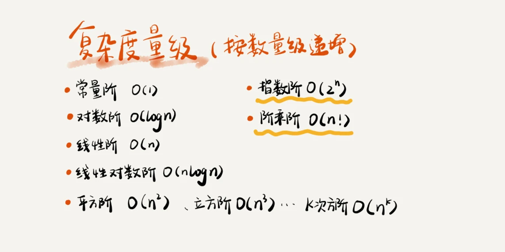
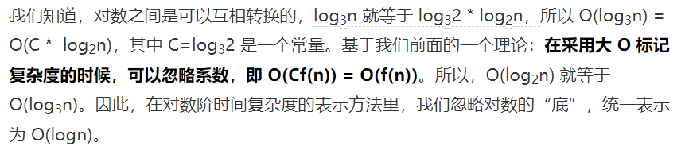
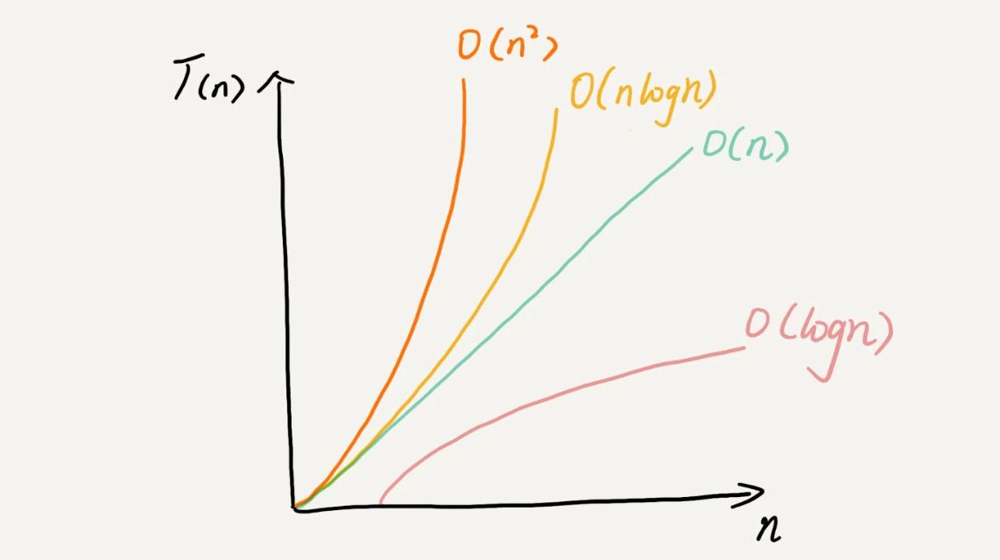

### 1.what 衡量算法优劣的指标是什么？
 - 时间复杂度
 - 空间复杂度


### 2.why 为什么需要这两个指标？
虽然可以将已有的代码在机器上实实在在的跑一遍可以得出算法执行的时间和占用的内存大小，但是在面临如下问题的时候会  
出现衡量标准发生了变化，也就是在物理机器上通过运行得到的结果是受限制于外部环境的。
例如：
 - 1.测试机器的配置差异   
   CPU的处理速度，内存的读写速率，磁盘的读写速率，网络的读写速率
 - 2.测试数据的规模大小
   对于排序，如果数据是有序的，则排序算法不需要任何操作，执行时间会非常短
   并且对于小规模的数据排序，插入排序可能反倒会比快速排序的速度要快
所以为了统一衡量的标准，所以使用了时间复杂度和空间复杂度来对算法的优劣进行衡量

### 3.how 这两个指标怎么用？
#### 3.1.时间复杂度
##### 3.1.1 时间复杂度的定义
比如对于如下代码：
```
1    int cal(int n) {
2        int sum = 0;
3       int i = 1;
4       for (; i <= n; ++i) {
5           sum = sum + i;
6    }
7    return sum;
}
```

从 CPU 的角度来看，这段代码的每一行都执行着类似的操作：读数据-运算-写数据。尽管每行代码对应的 CPU 执行的个数、
执行的时间都不一样，但是，我们这里只是粗略估计，所以可以假设每行代码执行的时间都一样，为 unit_time。在这个假
设的基础之上，这段代码的总执行时间是多少呢？
第 2、3 行代码分别需要 1 个 unit_time 的执行时间，第 4、5 行都 运行了 n 遍，所以需要 2n*unit_time 的执行
时间，所以这段代码总的执行时间就是 (2n+2)*unit_time。可以看出来， 所有代码的执行时间 T(n) 与每行代码的执行
次数成正比

我们可以把这个规律总结成一个公式。注意，大 O 就要登场了！
> T(n)  = O(f(n))

大 O 时间复杂度实际上并不具体表示代码真正的执行时间，而是表示代码执行时间随数据规模增长的变化趋势， 所以，也叫
作渐进时间复杂度（asymptotic time complexity），简称时间复杂度。
##### 3.1.2 如何分析代码的时间复杂度:可以遵循以下原则
- 1.只关注循环次数执行最多的一段代码   
大 O 这种复杂度表示方法只是表示一种变化趋势。我们通常会忽略掉公式中的常量、低阶、系数，只需要记录一个最大阶的
量级就可以了。所以，我们在分析一个算法、一段代码的时间复杂度的时候，也只关注循环执行次数最多的那一段代码就可以了。这
段核心代码执行次数的 n 的量级，就是整段要分析代码的时间复杂度。
- 2.加法法则:总复杂度等于量级最大的那段代码的复杂度
> 如果 T1(n)=O(f(n))，T2(n)=O(g(n))；那么 T(n)=T1(n)+T2(n)=max(O(f(n)), O(g(n))) =O(max(f(n), g(n))).
- 3.乘法法则：嵌套代码的复杂度等于嵌套内外代码复杂度的乘积
> T(n) = T1(n) * T2(n) = O(n*n) = O(n2)

##### 3.1.3 时间复杂度的分类:按照数量递增级别

- 多项式量级
O(1) O(n)

- 非多项式量级
O(2^n) 和 O(n!)

###### 几种常见时间复杂度案例
####### O(1)
```
int i = 8;
int j = 6;
int sum = i + j;
```
####### O(logn)、O(nlogn)
```
i=1; 
while (i <= n) { 
i = i * 2; 
}
```
上述代码如果想知道这行代码执行了多少次，通过2^x = n 求解x这个问题就知道结果了，x等于以2为底n的对数，所以
这段代码的时间复杂度是O(log2n)
```
i=1; 
while (i <= n) { 
i = i * 3; 
}
```
实际上，不管是以 2 为底、以 3 为底，还是以 10 为底，我们可以把所有对数阶的时间复杂度都记为 O(logn)。为什么呢？


####### O(m+n)、O(m*n)
```
int cal(int m, int n) {
  int sum_1 = 0;
  int i = 1;
  for (; i < m; ++i) {
    sum_1 = sum_1 + i;
  }

  int sum_2 = 0;
  int j = 1;
  for (; j < n; ++j) {
    sum_2 = sum_2 + j;
  }

  return sum_1 + sum_2;
}
```
m 和 n 是表示两个数据规模。我们无法事先评估 m 和 n 谁的量级大，所以我们在表示复杂度的时候，就不能简单地利用加法法则，
省略掉其中一个。所以，上面代码的时间复杂度就是 O(m+n)

#### 3.2.空间复杂度
##### 3.2.1 空间复杂度的定义
空间复杂度全称就是渐进空间复杂度（asymptotic space complexity），表示算法的存储空间与数据规模之间的增长关系
```
1    void print(int n) {
2        int i = 0;
3        int[] a = new int[n];
4        for (i; i <n; ++i) {
5            a[i] = i * i;
6         }
     }
```
我们可以看到，第 2 行代码中，我们申请了一个空间存储变量 i，但是它是常量阶的，跟数据规模 n 没有关系，所以我们可以忽略。第 3 行申请了一个大小为 n 的 int 类型数组，
除此之外，剩下的代码都没有占用更多的空间，所以整段代码的空间复杂度就是 O(n)
## 总结
越高阶复杂度的算法，执行效率越低



