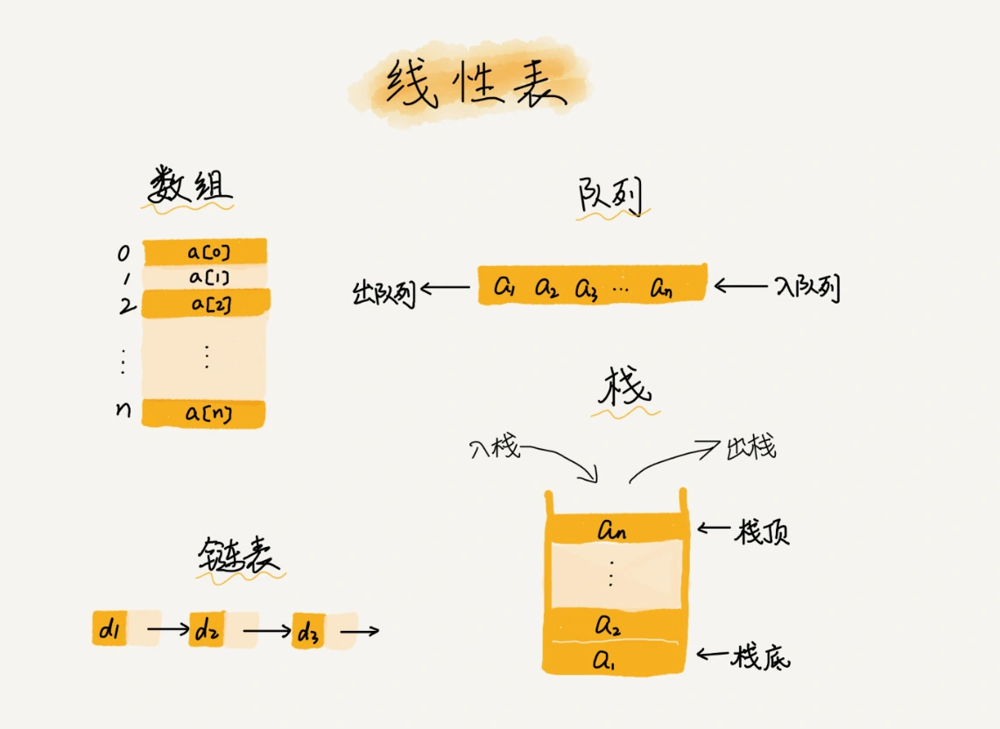
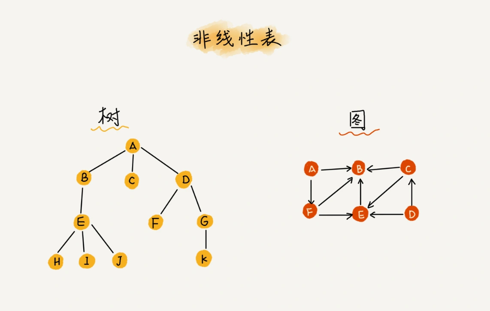

> 数据结构分类
从数据之间的联系最多只有前后两个方向上来分类，数据结构可分类为：
> - 线性表
数据排成像一条线一样的结构

> - 非线性表
数据之间不是简单的前后关系


### 1.数组的特性:
- 1.连续的内存空间和相同类型的数据，可以让数组得以随机访问
我们拿一个长度为 10 的 int 类型的数组 int[] a = new int[10]来举例。在我画的这个图中，计算机给数组 a[10]，分配了一块连续内存空间 1000～1039，其中，内存块的首地址为 base_address = 1000
```
a[i]_address = base_address + i * data_type_size
```
我们以Java语言为例，看其如何进行随访问的?
```
数据类型 引用 =new 数据类型（）；
int[] arr =new int[3]:
```
引用其实就是一个地址，放在栈内存中，实际存储的东西会放在堆内存中，引用中的地址是实际存储的东西的首地址。
当按照数组下标对数组进行访问时，就会按照引用当中找到的引用地址+数组下标*数组当中存储的数据类型所占的字节个数

> 在这里的需要注意的是: 数组支持随机访问，根据下标随机访问的时间复杂度为 O(1)

- 2.删除和新增操作的复杂度是O(n)
> 为了避免由于数组中的数据在删除的时候，进行数据的频繁移动，我们可以先记录下已经删除的数据。每次的删除操作并不是真正地搬移数据，只是记录数据已经被删除。当数组没有更多空间存储数据时，
> 我们再触发执行一次真正的删除操作，这样就大大减少了删除操作导致的数据搬移   
> **这也是JVM标记清除垃圾回收算法的核心思想**
> 
### 2.容器和数组之间的关系:
- 1.针对数组类型，很多语言都提供了容器类，比如Java中的ArrayList
  容器的定义：容器中可以包含多个对象，每个对象称为容器中的一个元素。容器是用对象封装的数据结构(data structure)
  数组本身在定义的时候需要预先指定大小，因为需要分配连续的内存空间。如果我们申请了大小为 10 的数组，当第 11 个数据需要存储到数组中时，我们就需要重新分配一块更大的空间，将原来的数据复制过去，然后再将新的数据插入。
  ArrayList 最大的优势就是可以将很多数组操作的细节封装起来,比如前面提到的数组插入、删除数据时需要搬移其他数据等。另外，它还有一个优势，就是支持动态扩容.
- 2.数组相比容器的用武之地：
  - 1.Java ArrayList 无法存储基本类型，比如 int、long，需要封装为 Integer、Long 类，而 Autoboxing、Unboxing 则有一定的性能消耗，所以如果特别关注性能，或者希望使用基本类型，就可以选用数组
  - 2.如果数据大小事先已知，并且对数据的操作非常简单，用不到 ArrayList 提供的大部分方法，也可以直接使用数组。
  - 3.当要表示多维数组时，用数组往往会更加直观。比如 Object[][] array；而用容器的话则需要这样定义：ArrayList > array。
  概括：对于业务开发，直接使用容器就足够了，省时省力。毕竟损耗一丢丢性能，完全不会影响到系统整体的性能。但如果你是做一些非常底层的开发，比如开发网络框架，性能的优化需要做到极致，这个时候数组就会优于容器，成为首选
> Java语言当中容器中的数组扩容是1.5倍，java语言扩容的方法中使用到了>>1  
### 3.其它问题
> 为什么大多数语言，数组的下表要从0开始，而不是从1开始呢？
> 答:从数组存储的内存模型上来看，“下标”最确切的定义应该是“偏移（offset）”。前面也讲到，如果用 a 来表示数组的首地址，a[0]就是偏移为 0 的位置，也就是首地址，a[k]就表示偏移 k 个 type_size 的位置，所以计算 a[k]的内存地址只需要用这个公式
> 历史原因：C 语言设计者用 0 开始计数数组下标，之后的 Java、JavaScript 等高级语言都效仿了 C 语言，或者说，为了在一定程度上减少 C 语言程序员学习 Java 的学习成本，因此继续沿用了从 0 开始计数的习惯。实际上，很多语言中数组也并不是从 0 开始计数的，比如 Matlab。甚至还有一些语言支持负数下标，比如 Python。

> 二维数组内存寻址方式：   
> 对于 m * n 的数组，a [ i ][ j ] (i < m,j < n)的地址为：  
> address = base_address + ( i * n + j) * type_size
### 总结


