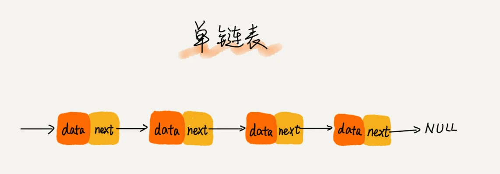

> 学习代码:
> * [SinglyLinkedList.java](SinglyLinkedList.java)

### 1.链表的定义:
- 1.不需要一块连续的内存空间，它通过“指针”将一组零散的内存块串联起来使用

### 2.为什么需要链表
- 1.没有整块的内存空间向数组这样的数据结构提供
- 2.数据特别多时，数组需要扩容，影响系统的性能

### 3.常见的链表结构
单链表、双向链表和循环链表
- 单链表

  单链表其中有两个结点是比较特殊的，它们分别是第一个结点和最后一个结点。我们习惯性地把第一个结点叫作头结点，把最后一个结点叫作尾结点。其中，头结点用来记录链表的基地址。有了它，我们就可以遍历得到整条链表。而尾结点特殊的地方是：指针不是指向下一个结点，而是指向一个空地址 NULL，表示这是链表上最后一个结点
- 循环链表

  它跟单链表唯一的区别就在尾结点。我们知道，单链表的尾结点指针指向空地址，表示这就是最后的结点了。而循环链表的尾结点指针是指向链表的头结点
- 双向链表

  单向链表只有一个方向，结点只有一个后继指针 next 指向后面的结点。而双向链表，顾名思义，它支持两个方向，每个结点不止有一个后继指针 next 指向后面的结点，还有一个前驱指针 prev 指向前面的结点
> java当中的LinkedList就是一个双向链表
### 4.链表结构的性能差异
- 在实际的软件开发中，从链表中删除一个数据无外乎这两种情况：
  - 删除结点中“值等于某个给定值”的结点；
  - 删除给定指针指向的结点
  
不管是单链表还是双向链表，为了查找到值等于给定值的结点，都需要从头结点开始一个一个依次遍历对比，直到找到值等于给定值的结点，然后再通过我前面讲的指针操作将其删除。   
尽管单纯的删除操作时间复杂度是 O(1)，但遍历查找的时间是主要的耗时点，对应的时间复杂度为 O(n)。根据时间复杂度分析中的加法法则，删除值等于给定值的结点对应的链表操作的总时间复杂度为 O(n)
对于第二种情况，我们已经找到了要删除的结点，但是删除某个结点 q 需要知道其前驱结点，而单链表并不支持直接获取前驱结点，所以，为了找到前驱结点，我们还是要从头结点开始遍历链表，直到 p->next=q，说明 p 是 q 的前驱结点。     
但是对于双向链表来说，这种情况就比较有优势了。因为双向链表中的结点已经保存了前驱结点的指针，不需要像单链表那样遍历。所以，针对第二种情况，单链表删除操作需要 O(n) 的时间复杂度，而双向链表只需要在 O(1) 的时间复杂度内就搞定了！      
除了插入、删除操作有优势之外，对于一个有序链表，双向链表的按值查询的效率也要比单链表高一些。因为，我们可以记录上次查找的位置 p，每次查询时，根据要查找的值与 p 的大小关系，决定是往前还是往后查找，所以平均只需要查找一半的数据。
实际上，这里有一个更加重要的知识点需要你掌握，那就是用空间换时间的设计思想。当内存空间充足的时候，如果我们更加追求代码的执行速度，我们就可以选择空间复杂度相对较高、但时间复杂度相对很低的算法或者数据结构。相反，如果内存比较紧缺，比如代码跑在手机或者单片机上，这个时候，就要反过来用时间换空间的设计思路。

### 5.链表 VS 数组性能大比拼

> 注意这里链表的删除是O(1),指的是删除过程需要的时间复杂度是O(1),但删除时候需要进行查询，查询的时间复杂度是O(n),根据时间复杂度分析中的加法法则，删除值等于给定值的结点对应的链表操作的总时间复杂度为 O(n)

数组简单易用，在实现上使用的是连续的内存空间，可以借助 CPU 的缓存机制，预读数组中的数据，所以访问效率更高。而链表在内存中并不是连续存储，所以对 CPU 缓存不友好，没办法有效预读。     
数组的缺点是大小固定，一经声明就要占用整块连续内存空间。如果声明的数组过大，系统可能没有足够的连续内存空间分配给它，导致“内存不足（out of memory）”
如果声明的数组过小，则可能出现不够用的情况。这时只能再申请一个更大的内存空间，把原数组拷贝进去，非常费时。链表本身没有大小的限制，天然地支持动态扩容，我觉得这也是它与数组最大的区别.
你可能会说，我们 Java 中的 ArrayList 容器，也可以支持动态扩容啊？我们上一节课讲过，当我们往支持动态扩容的数组中插入一个数据时，如果数组中没有空闲空间了，就会申请一个更大的空间，将数据拷贝过去，而数据拷贝的操作是非常耗时的。     
我举一个稍微极端的例子。如果我们用 ArrayList 存储了了 1GB 大小的数据，这个时候已经没有空闲空间了，当我们再插入数据的时候，ArrayList 会申请一个 1.5GB 大小的存储空间，并且把原来那 1GB 的数据拷贝到新申请的空间上。听起来是不是就很耗时？       
除此之外，如果你的代码对内存的使用非常苛刻，那数组就更适合你。因为链表中的每个结点都需要消耗额外的存储空间去存储一份指向下一个结点的指针，所以内存消耗会翻倍。而且，对链表进行频繁的插入、删除操作，还会导致频繁的内存申请和释放，容易造成内存碎片，如果是 Java 语言，就有可能会导致频繁的 GC（Garbage Collection，垃圾回收）。

### 6.应用场景：使用链表实现LRU缓存淘汰算法
> 缓存的大小有限，当缓存被用满时，哪些数据应该被清理出去，哪些数据应该被保留？这就需要缓存淘汰策略来决定。常见的策略有三种：先进先出策略 FIFO（First In，First Out）、最少使用策略 LFU（Least Frequently Used）、最近最少使用策略 LRU（Least Recently Used）

我们维护一个有序单链表，越靠近链表尾部的结点是越早之前访问的。当有一个新的数据被访问时，我们从链表头开始顺序遍历链表。   
1. 如果此数据之前已经被缓存在链表中了，我们遍历得到这个数据对应的结点，并将其从原来的位置删除，然后再插入到链表的头部。     
2. 如果此数据没有在缓存链表中，又可以分为两种情况：   
   如果此时缓存未满，则将此结点直接插入到链表的头部；   
   如果此时缓存已满，则链表尾结点删除，将新的数据结点插入链表的头部。 

### 7.指针
将某个变量赋值给指针，实际上就是将这个变量的地址赋值给指针，或者反过来说，指针中存储了这个变量的内存地址，指向了这个变量，
通过指针就能找到这个变量，在Java语言中，可以将值的引用作为指针来看待。

### 总结

[]: #SinglyLinkedList.java