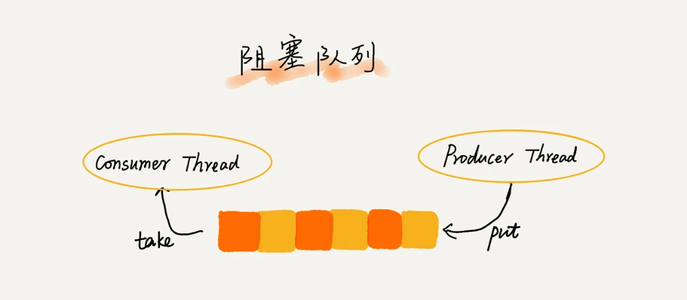
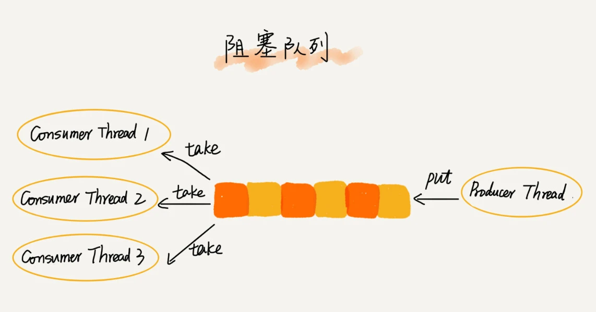

> 学习代码:
> * [MyQueue.java](MyQueue.java)

### 1.队列的定义:
- 1.先进者先出，类似排队买东西，最先来的先买。
- 2.栈是一种“操作受限”的线性表，只允许在一端插入和删除数据

### 2.为什么会需要队列的存在
- 1.数组或链表暴露了太多的操作接口，操作上的确灵活自由，但使用时就比较不可控
- 2.当某个数据集合只涉及在一端插入和删除数据，并且满足先进先出、后进后出的特性，这时我们就应该首选“队列”这种数据结构

### 3.如何实现一个队列数据结构
- 1.利用数组实现的顺序队列
- 2.利用链表实现的链式队列
> **两者之间的区别:**   
> **基于数组实现的有界队列（bounded queue）** 队列的大小有限，所以线程池中排队的请求超过队列大小时，接下来的请求就会被拒绝，这种方式对响应时间敏感的系统来说，就相对更加合理。不过，设置一个合理的队列大小，也是非常有讲究的。
> 队列太大导致等待的请求太多，队列太小会导致无法充分利用系统资源、发挥最大性能。   
> **基于链表可以实现一个支持无限排队的无界队列（unbounded queue）** 但是可能会导致过多的请求排队等待，请求处理的响应时间过长。所以，针对响应时间比较敏感的系统，基于链表实现的无限排队的线程池是不合适的

### 4.队列的使用
- 阻塞队列   
  就是在队列为空的时候，从队头取数据会被阻塞。因为此时还没有数据可取，直到队列中有了数据才能返回；如果队列已经满了，那么插入数据的操作就会被阻塞，直到队列中有空闲位置后再插入数据，然后再返回
  
- 并发队列   
  最简单直接的实现方式是直接在 enqueue()、dequeue() 方法上加锁，但是锁粒度大并发度会比较低，同一时刻仅允许一个存或者取操作。实际上，基于数组的循环队列，利用 CAS 原子操作，可以实现非常高效的并发队列。
  这也是循环队列比链式队列应用更加广泛的原因
  

### 5.队列的拓展
- 循环队列
> 比如高性能队列 Disruptor、Linux 环形缓存，都用到了循环并发队列

### 6.应用场景：
- 1.线程池中多出的任务
- 2.Java concurrent 并发包利用 ArrayBlockingQueue 来实现公平锁

### 总结

