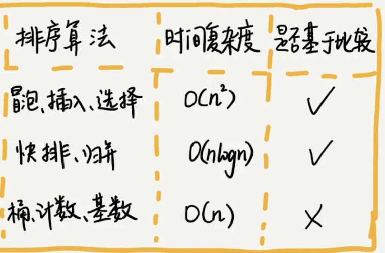

> 排序算法介绍: https://mp.weixin.qq.com/s/HQg3BzzQfJXcWyltsgOfCQ
> 分治是一种思想，递归是一种编程技巧

### 1.排序方法
  

### 2.如何分析一个"排序算法"
<1>算法的执行效率
- 最好、最坏、平均情况时间复杂度。
- 时间复杂度的系数、常数和低阶。
- 比较次数，交换（或移动）次数。    

<2>排序算法的稳定性  
- 稳定性概念：如果待排序的序列中存在值相等的元素，经过排序之后，相等元素之间原有的先后顺序不变。
- 稳定性重要性：可针对对象的多种属性进行有优先级的排序。
- 举例：给电商交易系统中的“订单”排序，按照金额大小对订单数据排序，对于相同金额的订单以下单时间早晚排序。用稳定排序算法可简洁地解决。先按照下单时间给订单排序，排序完成后用稳定排序算法按照订单金额重新排序。

<3>排序算法的内存损耗  
- 原地排序算法：特指空间复杂度是O(1)的排序算法。

### 3.排序算法:
<1>冒泡排序
- 概念：冒泡排序只会操作相邻的两个数据。每次冒泡操作都会对相邻的两个元素进行比较，看是否满足大小关系要求，如果不满足就让它俩互换。
- 稳定性：冒泡排序是稳定的排序算法。
- 空间复杂度：冒泡排序是原地排序算法。
- 时间复杂度：
  - 最好情况（满有序度）：O(n)。
  - 最坏情况（满逆序度）：O(n^2)。
  - 平均情况：
       “有序度”和“逆序度”：对于一个不完全有序的数组，如4，5，6，3，2，1，有序元素对为3个（4，5），（4，6），（5，6），有序度为3，逆序度为12；对于一个完全有序的数组，如1，2，3，4，5，6，有序度就是n*(n-1)/2，也就是15，称作满有序度；逆序度=满有序度-有序度；冒泡排序、插入排序交换（或移动）次数=逆序度。
       最好情况下初始有序度为n*(n-1)/2，最坏情况下初始有序度为0，则平均初始有序度为n*(n-1)/4，即交换次数为n*(n-1)/4，因交换次数<比较次数<最坏情况时间复杂度，所以平均时间复杂度为O(n^2)

<2>插入排序
- 概念：插入排序将数组数据分成已排序区间和未排序区间。初始已排序区间只有一个元素，即数组第一个元素。在未排序区间取出一个元素插入到已排序区间的合适位置，直到未排序区间为空。
- 空间复杂度：插入排序是原地排序算法。
- 时间复杂度：
  - 最好情况：O(n)。
  - 最坏情况：O(n^2)。
  - 平均情况：O(n^2)（往数组中插入一个数的平均时间复杂度是O(n)，一共重复n次）。
- 稳定性：插入排序是稳定的排序算法。

<3>选择排序
- 概念：选择排序将数组分成已排序区间和未排序区间。初始已排序区间为空。每次从未排序区间中选出最小的元素插入已排序区间的末尾，直到未排序区间为空。
- 空间复杂度：选择排序是原地排序算法。
- 时间复杂度：（都是O(n^2)）
  - 最好情况：O(n^2)。
  - 最坏情况：O(n^2)。
  - 平均情况：O(n^2)。
- 稳定性：选择排序不是稳定的排序算法。

<4>归并排序 
> 学习代码:
> * [MergeSort.java](MergeSort.java)

<5>快速排序
**快排核心思想就是分治和分区**

> 学习代码:
> * [QuickSort.java](QuickSort.java)   

<6>桶排序
将要排序的元素放进几个有序的桶里，对桶里的元素进行排序，然后按照桶的顺序依次将数据拿出，即可排好序
> 缺点：排序的元素需要分布比较均匀

<7>计数排序
> 缺点：只能对非负整数进行排序，但是可以对将数据进行处理，比如每个元素加上1000，对与小数，可以根据需要扩大指定倍数

<8>基数排序
> 缺点：数据可以分割出独立的"位"进行比较
比如对手机号码进行排序，或者对牛津词典中的单词进行排序，那么可能需要对单词进行补位操作


>
>
### 实际应用
- 如何用快排思想在O(n)内找寻第K大元素？
  - 利用快排思想根据分区点左右两侧与K值的大小进行比较，不断递归，直至分区点+1=K，此时从数组中取出分区点即为第K大元素
- 如何根据年龄给100万用户排序
- 如何根据分数给全国考生进行排名
- 如何对数字，大小写字母进行排序
  - 都可以利用桶排序


### 4.实际工作技巧
选择排序和插入排序的时间复杂度相同，都是O(n^2)，在实际的软件开发中，为什么我们更倾向于使用插入排序而不是冒泡排序算法呢？   
答：从代码实现上来看，冒泡排序的数据交换要比插入排序的数据移动要复杂，冒泡排序需要3个赋值操作，而插入排序只需要1个，所以在对相同数组进行排序时，冒泡排序的运行时间理论上要长于插入排序。


### 总结
- 归并是先分解再合并排序，最后需要复制回原数组，而快速是先分区排序后分解排序即可。
- 桶排序，计数排序，基数排序都不涉及元素之间的比较操作

> 一个小技巧：如何在不声明中间值的情况下对数组中的两个位进行交换操作
> 答：在Java中可以使用^操作符
> 代码如下：
```
ints[i] ^= ints[j]
ints[j] ^= ints[i]
ints[i] ^= ints[j]
```

