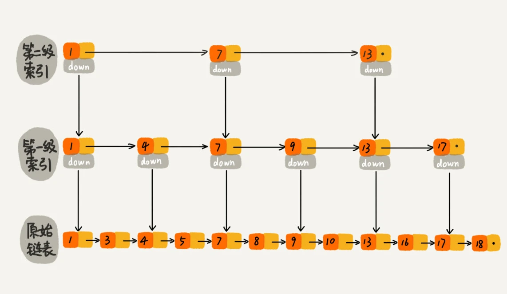

> Redis 中的有序集合（Sorted Set）就是用跳表来实现的

### 1.为何出现跳表查找
因为二分查找底层依赖的是数组随机访问的特性，所以只能用数组来实现。如果数据存储在链表中，就真的没法用二分查找算法了吗？
实际上，我们只需要对链表稍加改造，就可以支持类似“二分”的查找算法。我们把改造之后的数据结构叫做跳表（Skip list）
可以支持快速地插入、删除、查找操作，写起来也不复杂，甚至可以替代红黑树（Red-black tree）。

### 2.跳表是如何实现的
- 1.采用单链表的数据结构，每两个节点提取一个节点到上一级，我们把抽出来的那一级叫索引或索引层
- 2.将这种索引层的应用进行多级应用，就可以实现快速查询

### 3.跳表的特性
- 1.跳表的查询有多快？
  - 时间复杂度: O(logn)
  - 空间复杂度: O(n)
- 2.设计跳表应该注意的问题
  - 1.查找和更新跳表的过程一样，但是删除的时候要注意，单链表在删除结点时，一定要获取前驱结点。注意对索引层的处理(双链表就不用了)
  - 2.跳表索引动态更新
    - 如果我们不停的往链表中插入数据时，就可能出现某2个索引节点之间的数据非常多的情况，极端情况下，跳表会退化成单链表
    - 作为一种动态数据结构，我们需要某种手段来维护索引与原始链表大小之间的平衡，也就是说，如果链表中结点多了，索引结点就相应地增加一些，避免复杂度退化，以及查找、插入、删除操作性能下降
      当我们往跳表中插入数据的时候，我们可以选择同时将这个数据插入到部分索引层中。如何选择加入哪些索引层呢？我们通过一个随机函数，来决定将这个结点插入到哪几级索引中，比如随机函数生成了值 K，那我们就将这个结点添加到第一级到第 K 级这 K 级索引中。
 
### 总结
- Redis为何使用跳表来实现有序集合？（严格来说，Redis的有序集合还用到了散列表）
  - Redis中的有序集合支持的核心操作主要有下面这几个
    - 插入一个数据；
    - 删除一个数据；
    - 查找一个数据；
    - 按照区间查找数据（比如查找值在[100, 356]之间的数据）；
    - 迭代输出有序序列
    
其中，插入、删除、查找以及迭代输出有序序列这几个操作，红黑树也可以完成，时间复杂度跟跳表是一样的。但是，按照区间来查找数据这个操作，红黑树的效率没有跳表高   
对于按照区间查找数据这个操作，跳表可以做到 O(logn) 的时间复杂度定位区间的起点，然后在原始链表中顺序往后遍历就可以了。这样做非常高效。     
当然，Redis 之所以用跳表来实现有序集合，还有其他原因，比如，跳表更容易代码实现。虽然跳表的实现也不简单，但比起红黑树来说还是好懂、好写多了，而简单就意味着可读性好，不容易出错。还有，跳表更加灵活，它可以通过改变索引构建策略，有效平衡执行效率和内存消耗。        
不过，跳表也不能完全替代红黑树。因为红黑树比跳表的出现要早一些，很多编程语言中的 Map 类型都是通过红黑树来实现的。我们做业务开发的时候，直接拿来用就可以了，不用费劲自己去实现一个红黑树，但是跳表并没有一个现成的实现，所以在开发中，如果你想使用跳表，必须要自己实现。