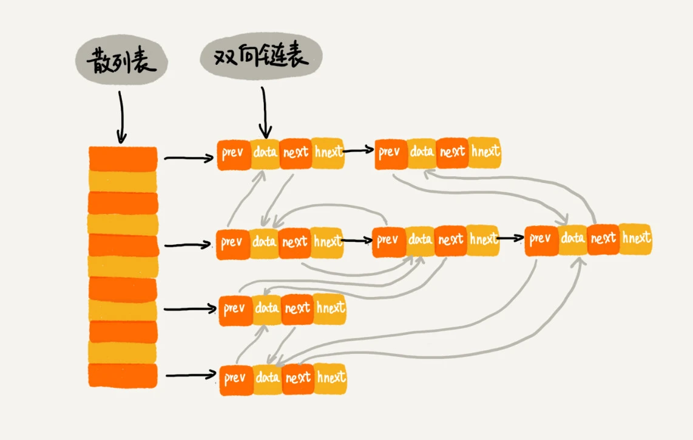

> Word文档中的单词拼写检查功能是如何实现的？
> 答：常用的英文单词有 20 万个左右，假设单词的平均长度是 10 个字母，平均一个单词占用 10 个字节的内存空间，那 20 万英文单词大约占 2MB 的存储空间，
> 就算放大 10 倍也就是 20MB。对于现在的计算机来说，这个大小完全可以放在内存里面。所以我们可以用散列表来存储整个英文单词词典。当用户输入某个英文单词时，我们拿用户输入的单词去散列表中查找。如果查到，则说明拼写正确；如果没有查到，则说明拼写可能有误，给予提示。借助散列表这种数据结构，我们就可以轻松实现快速判断是否存在拼写错误。

### 1.什么叫散列表
散列表的英文叫“Hash Table”，我们平时也叫它“哈希表”或者“Hash 表”。   
散列表用的是数组支持按照下标随机访问数据的特性，所以散列表其实就是数组的一种扩展，由数组演化而来。可以说，如果没有数组，就没有散列表。
> 我理解的hash表就是利用扰动函数对key值求得一个哈希值后，然后根据这个哈希值与hash table的容量做余，然后得到数组的下标位置，进而将value
>值存放进去，然后取的时候根据所查value的key进行hash后，得到数组下标，利用数组寻址的特性进而快速找到数组当中存放的值

### 2.散列冲突
在真实的情况下，要想找到一个不同的 key 对应的散列值都不一样的散列函数，几乎是不可能的。即便像业界著名的MD5、SHA、CRC等哈希算法，也无法完全避免这种散列冲突。而且，因为数组的存储空间有限，也会加大散列冲突的概率。
再好的散列函数也无法避免散列冲突。那究竟该如何解决散列冲突问题呢？   
解决方案：
- 1.开放寻址法解决方案

  - 线性探测     
  使用线性探测的方式对hash table进行增删查时，过程如下：   
    - 增：当我们往散列表中插入数据时，如果某个数据经过散列函数散列之后，存储位置已经被占用了，我们就从当前位置开始，依次往后查找，看是否有空闲位置，直到找到为止。    
    - 查：在散列表中查找元素的过程有点儿类似插入过程。我们通过散列函数求出要查找元素的键值对应的散列值，然后比较数组中下标为散列值的元素和要查找的元素。如果相等，则说明就是我们要找的元素；否则就顺序往后依次查找。如果遍历到数组中的空闲位置，还没有找到，就说明要查找的元素并没有在散列表中     
    - 删除：删除操作稍微有些特别。我们不能单纯地把要删除的元素设置为空。这是为什么呢？还记得我们刚讲的查找操作吗？在查找的时候，一旦我们通过线性探测方法，找到一个空闲位置，我们就可以认定散列表中不存在这个数据。但是，如果这个空闲位置是我们后来删除的，就会导致原来的查找算法失效。本来存在的数据，
       会被认定为不存在。这个问题如何解决呢？我们可以将删除的元素，特殊标记为 deleted。当线性探测查找的时候，遇到标记为 deleted 的空间，并不是停下来，而是继续往下探测。
  
  - 二次探测
  所谓二次探测，跟线性探测很像，线性探测每次探测的步长是 1，那它探测的下标序列就是 hash(key)+0，hash(key)+1，hash(key)+2……而二次探测探测的步长就变成了原来的“二次方”，也就是说，它探测的下标序列就是 hash(key)+0，hash(key)+12，hash(key)+22
  
  - 双重散列
  意思就是不仅要使用一个散列函数。我们使用一组散列函数 hash1(key)，hash2(key)，hash3(key)……我们先用第一个散列函数，如果计算得到的存储位置已经被占用，再用第二个散列函数，依次类推，直到找到空闲的存储位置。

  **不管采用哪种探测方法，当散列表中空闲位置不多的时候，散列冲突的概率就会大大提高。为了尽可能保证散列表的操作效率，一般情况下，我们会尽可能保证散列表中有一定比例的空闲槽位。我们用装载因子（load factor）来表示空位的多少。装载因子的计算公式是:**
  > 散列表的装载因子=填入表中的元素个数/散列表的长度
                                                                                                                                                                                                                                                                                                                                                                                                                                                                                                                                                                                                                                                                                                                                                                                                                                                                                                                                                                                                                                                                                                                                                                                                                                                                                                                                                                                                                                                                                                                                                                                                                                                                                                                                                                                                                                                                                                                                                                                                                                                                                                                                                                                                                                                                                                                                                                                                                                                                                                                                                                                                                                                                                                                                                                                                                                                                                                                                                                                                                                                                                                                                                                                                                                                                                                                                                                                                                                                                                                                                                                                                                                                                                                                                                                                                                                                                                                                                                                                                                                                                                                                                                                                                                                                                                                                                                                                                                                                                                                                                                                                                                                                                                                                                                                                                                                                                                                                                                                                                                                                                                                                                                                                                                                                                                                                                                                                                                                                                                                                                                                                                                                                                                                                                                                                                                                                                                                                                                                                                                                                                                     
  装载因子越大，说明空闲位置越少，冲突越多，散列表的性能会下降。   
  
  *优点*
  开放寻址法不像链表法，需要拉很多链表。散列表中的数据都存储在数组中，可以有效地利用 CPU 缓存加快查询速度。而且，这种方法实现的散列表，序列化起来比较简单。链表法包含指针，序列化起来就没那么容易。
  > 当数据量比较小、装载因子小的时候，适合采用开放寻址法。这也是 Java 中的ThreadLocalMap使用开放寻址法解决散列冲突的原因。 
  
- 2.链表法                                                                                                                                                                                                                                                                                                                                                                                                                                                                                                                                                                                                                                                                                                                                                                                                                                                                                                                                                                                                                          
  链表法是一种更加常用的散列冲突解决办法，相比开放寻址法，它要简单很多。我们来看这个图，在散列表中，每个“桶（bucket）”或者“槽（slot）”会对应一条链表，所有散列值相同的元素我们都放到相同槽位对应的链表中                                                                                                                                                                                                                                                                                                                                                                                                                                                                                                                                                                                                                                                                                                                                                                                                                                                                                                                                                                                                                  
   
  *优点*
  链表法对内存的利用率比开放寻址法要高。因为链表结点可以在需要的时候再创建，并不需要像开放寻址法那样事先申请好
  
  > 基于链表的散列冲突处理方法比较适合存储大对象、大数据量的散列表，而且，比起开放寻址法，它更加灵活，支持更多的优化策略，比如用红黑树代替链表。                                                         
                                                                                                                                                                                                                                                                                                                                                                                                                                                                                                                                                                                                                                                                                                                                                                                                                                                                                                                                                                                                                                 
### 3.如何打造一个高水准的工业级水平的散列表
通过章节1和2，我们知道:
散列表的查询效率并不能笼统地说成是 O(1)。它跟散列函数、装载因子、散列冲突等都有关系。如果散列函数设计得不好，或者装载因子过高，都可能导致散列冲突发生的概率升高，查询效率下降。       
在极端情况下，有些恶意的攻击者，还有可能通过精心构造的数据，使得所有的数据经过散列函数之后，都散列到同一个槽里。如果我们使用的是基于链表的冲突解决方法，那这个时候，散列表就会退化为链表，查询的时间复杂度就从 O(1) 急剧退化为 O(n)。        
如果散列表中有 10 万个数据，退化后的散列表查询的效率就下降了 10 万倍。更直接点说，如果之前运行 100 次查询只需要 0.1 秒，那现在就需要 1 万秒。这样就有可能因为查询操作消耗大量 CPU 或者线程资源，导致系统无法响应其他请求，从而达到拒绝服务攻击（DoS）的目的。这也就是散列表碰撞攻击的基本原理。                                                                                                                                                                                                                                                                                                                                                                                                                                                                                                                                                                                                                                                                                                                                                                                                                                                                                                                                                                                                                                
关于如何设计一个高水准的散列表，要素有以下几点：
- 1.设计散列函数？     
散列函数的设计不能太复杂。过于复杂的散列函数，势必会消耗很多计算时间，也就间接地影响到散列表的性能。其次，散列函数生成的值要尽可能随机并且均匀分布，这样才能避免或者最小化散列冲突，而且即便出现冲突，散列到每个槽里的数据也会比较平均，不会出现某个槽内数据特别多的情况。  

- 2.合理的装载因子？
装载因子越大，说明散列表中的元素越多，空闲位置越少，散列冲突的概率就越大。不仅插入数据的过程要多次寻址或者拉很长的链，查找的过程也会因此变得很慢
  - 动态扩容
  针对数组的扩容，数据搬移操作比较简单。但是，针对散列表的扩容，数据搬移操作要复杂很多。因为散列表的大小变了，数据的存储位置也变了，所以我们需要通过散列函数重新计算每个数据的存储位置。
  - 动态缩容
  对于动态散列表，随着数据的删除，散列表中的数据会越来越少，空闲空间会越来越多。如果我们对空间消耗非常敏感，我们可以在装载因子小于某个值之后，启动动态缩容。当然，如果我们更加在意执行效率，能够容忍多消耗一点内存空间，那就可以不用费劲来缩容了。
  - 如何避免低效的扩容
  为了解决一次性扩容耗时过多的情况，我们可以将扩容操作穿插在插入操作的过程中，分批完成。
  当有新数据要插入时，我们将新数据插入新散列表中，并且从老的散列表中拿出一个数据放入到新散列表。每次插入一个数据到散列表，我们都重复上面的过程。
- 3.选择合适的散列冲突解决方法
  参见基与开放寻址法与链表法的各自适合的场景
  
### 4.为何散列表和链表经常会一起使用？
我们使用双向链表存储数据，链表中的每个结点处理存储数据（data）、前驱指针（prev）、后继指针（next）之外，还新增了一个特殊的字段 hnext。    
这个 hnext 有什么作用呢？因为我们的散列表是通过链表法解决散列冲突的，所以每个结点会在两条链中。一个链是刚刚我们提到的双向链表，另一个链是散列表中的拉链。前驱和后继指针是为了将结点串在双向链表中，hnext 指针是为了将结点串在散列表的拉链中。

  
> 关于如何做数组、栈、队列的动态扩容的？
> 数组: 每次当空间不足的时候,申请原来长度两倍的新空间,然后拷贝 
> 栈: 支持动态扩容的顺序栈.底层依赖的是一个支持动态扩容的数组.栈满了以后,就申请一个更大的数组,将原来的数据搬移到新的数组中. 对于出栈操作,不涉及内存的重新申请和数据的搬移,所以还是O(1)但是入栈需要考虑是否需要扩容,如果要扩容,那就是O(n) 
> 队列:每次在出队的时候,进行数据搬迁,把head和tail这一整段的搬迁到新的队列中去,出队的时间复杂度会变为O(n)
