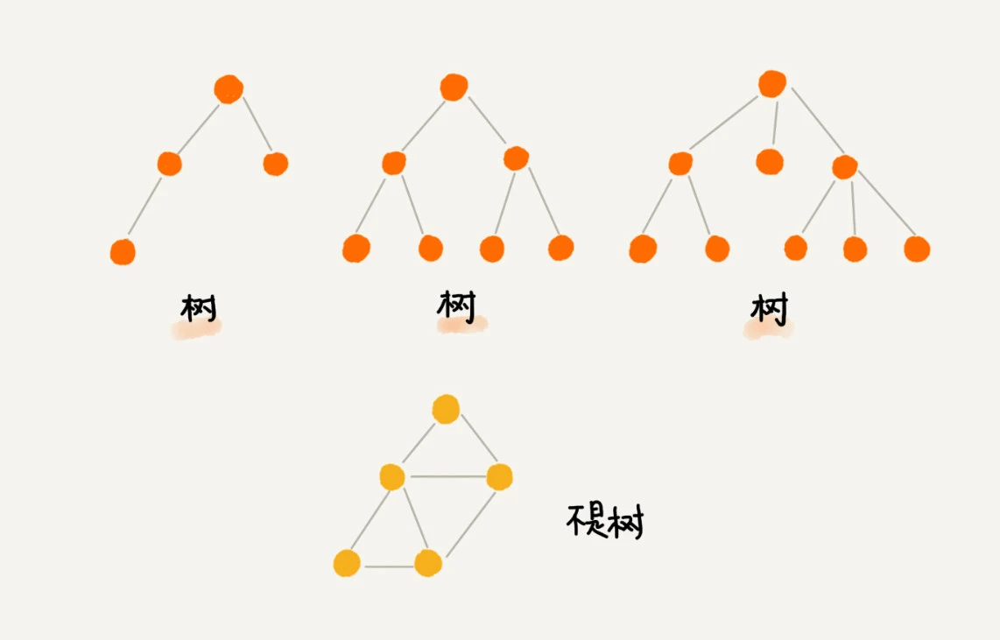
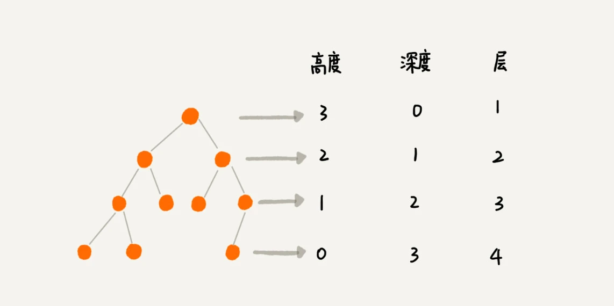
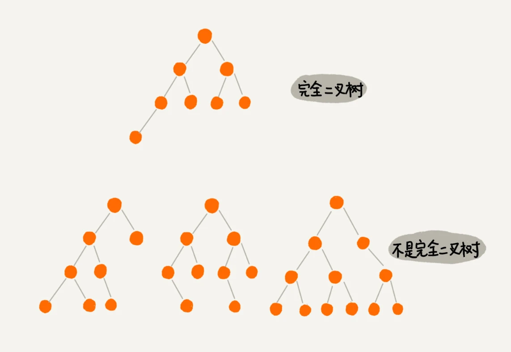
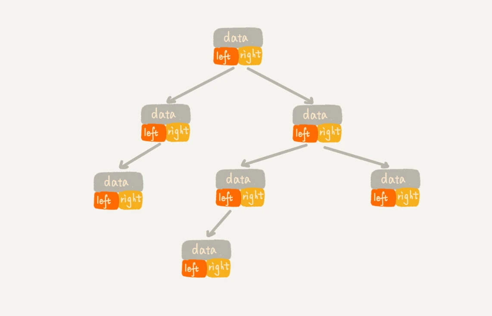
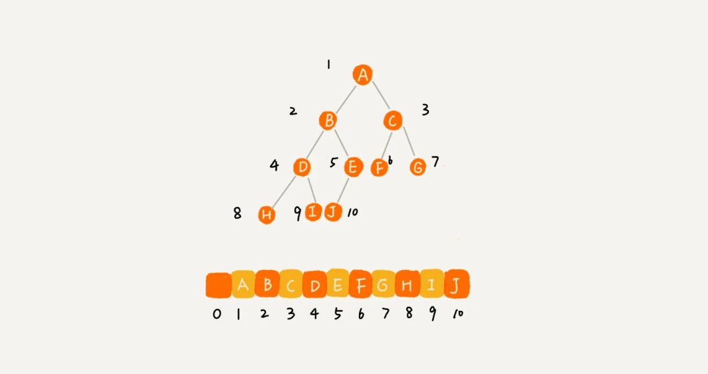

### 1.树
树的定义: N个结点构成的有限集合。 树中有一个称为”根(Root)”的特殊结点 其余结点可分为若干个互不相交的树，称为原来结点的”子树”

关于树的几个概念：
- 1.父节点
- 2.子节点
- 3.兄弟节点
- 4.根节点 （没有父节点的节点）
- 5.叶节点或者叶子节点（没有子节点的节点）
- 6.高度
  - 节点的高度: 节点到叶子节点的最长路径(边数)
  - 树的高度:   根节点到这个节点所经历的边的个数
- 7.深度: 根节点到这个节点所经历的边的个数
- 8.层:   节点的深度 + 1 
  
### 2.二叉树
- 二叉树的定义: 每个节点最多有两个“叉”，也就是两个子节点，分别是左子节点和右子节点。
  - 满二叉树: 叶子节点全都在最底层，除了叶子节点之外，每个节点都有左右两个子节点
  - 完全二叉树: 最后一层的叶子节点都靠左排列，且连续排列.
  
> 堆其实就是一种完全二叉树，最常用的存储方式就是数组
  
### 3.如何存储一个二叉树呢？
- 1.一种是基于指针或者引用的二叉链式存储法
  
- 2.一种是基于数组的顺序存储法
  
  解释: 我们把根节点存储在下标 i = 1 的位置，那左子节点存储在下标 2 * i = 2 的位置，右子节点存储在 2 * i + 1 = 3 的位置。以此类推，B 节点的左子节点存储在 2 * i = 2 * 2 = 4 的位置，右子节点存储在 2 * i + 1 = 2 * 2 + 1 = 5 的位置。
  > 数组顺序存储的方式比较适合完全二叉树，其他类型的二叉树用数组存储会比较浪费存储空间
### 3.二叉树的遍历方式
- 1.前序遍历
  对于树中的任意节点来说，先打印这个节点，然后再打印它的左子树，最后打印它的右子树。
- 2.中序遍历
  对于树中的任意节点来说，先打印它的左子树，然后再打印它本身，最后打印它的右子树
- 3.后序遍历
  对于树中的任意节点来说，先打印它的左子树，然后再打印它的右子树，最后打印这个节点本身
> * 学习代码: [MyBinaryTree.java](MyBinaryTree.java)

### 4.二叉树遍历的时间复杂度
时间复杂度是 O(n)

### 5.二叉树的增删查功能
- 二叉树查找    
  二叉查找树要求，在树中的任意一个节点，其左子树中的每个节点的值，都要小于这个节点的值，而右子树节点的值都大于这个节点的值
- 二叉树的插入
- 二叉树的删除
> 二叉查找树中，每个节点的值都大于左子树节点的值，小于右子树节点的值。不过，这只是针对没有重复数据的情况。对于存在重复数据的二叉查找树，    
> 我介绍了两种构建方法，一种是让每个节点存储多个值相同的数据；另一种是，每个节点中存储一个数据。针对这种情况，我们只需要稍加改造原来的插入、删除、查找操作即可。    
> 在二叉查找树中，查找、插入、删除等很多操作的时间复杂度都跟树的高度成正比。两个极端情况的时间复杂度分别是 O(n) 和 O(logn)，分别对应二叉树退化成链表的情况和完全二叉树。    

### 6.有了如此高效的散列表，为什么还需要二叉树？
散列表的插入、删除、查找操作的时间复杂度可以做到常量级的 O(1)，非常高效。而二叉查找树在比较平衡的情况下，插入、删除、查找操作时间复杂度才是 O(logn)，相对散列表，好像并没有什么优势，那我们为什么还要用二叉查找树呢？
原因有以下：
- 1.散列表中的数据是无序存储的，如果要输出有序的数据，需要先进行排序。而对于二叉查找树来说，我们只需要中序遍历，就可以在 O(n) 的时间复杂度内，输出有序的数据序列。
- 2.散列表扩容耗时很多，而且当遇到散列冲突时，性能不稳定，尽管二叉查找树的性能不稳定，但是在工程中，我们最常用的平衡二叉查找树的性能非常稳定，时间复杂度稳定在 O(logn)。
- 3.笼统地来说，尽管散列表的查找等操作的时间复杂度是常量级的，但因为哈希冲突的存在，这个常量不一定比 logn 小，所以实际的查找速度可能不一定比 O(logn) 快。加上哈希函数的耗时，也不一定就比平衡二叉查找树的效率高。
- 4.散列表的构造比二叉查找树要复杂，需要考虑的东西很多。比如散列函数的设计、冲突解决办法、扩容、缩容等。平衡二叉查找树只需要考虑平衡性这一个问题，而且这个问题的解决方案比较成熟、固定
- 5.为了避免过多的散列冲突，散列表装载因子不能太大，特别是基于开放寻址法解决冲突的散列表，不然会浪费一定的存储空间
总结：平衡二叉查找树在某些方面还是优于散列表的，所以，这两者的存在并不冲突。我们在实际的开发过程中，需要结合具体的需求来选择使用哪一个。

