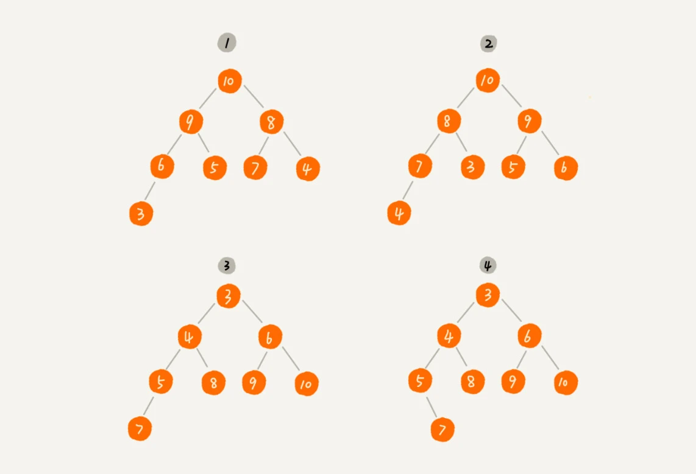

### 1.为什么说堆排序没有快速排序快？

### 2.如何为堆？
- 1.堆是一个完全二叉树 （意味着可以用数组的方式来存储）
- 2.堆中每一个节点的值都必须大于等于（或小于等于）其子树中每个节点的值

其中(1)和(2)是大顶堆，(3)是小顶堆，4不是堆
> 堆中每一个节点的值大于等于其子树中每个节点的值 大顶堆
> 堆中每一个节点的值小于等于其子树中每个节点的值 小顶堆

### 3.有关堆的操作
- 1.往堆中插入一个元素
- 2.删除堆顶元素
- 3.

