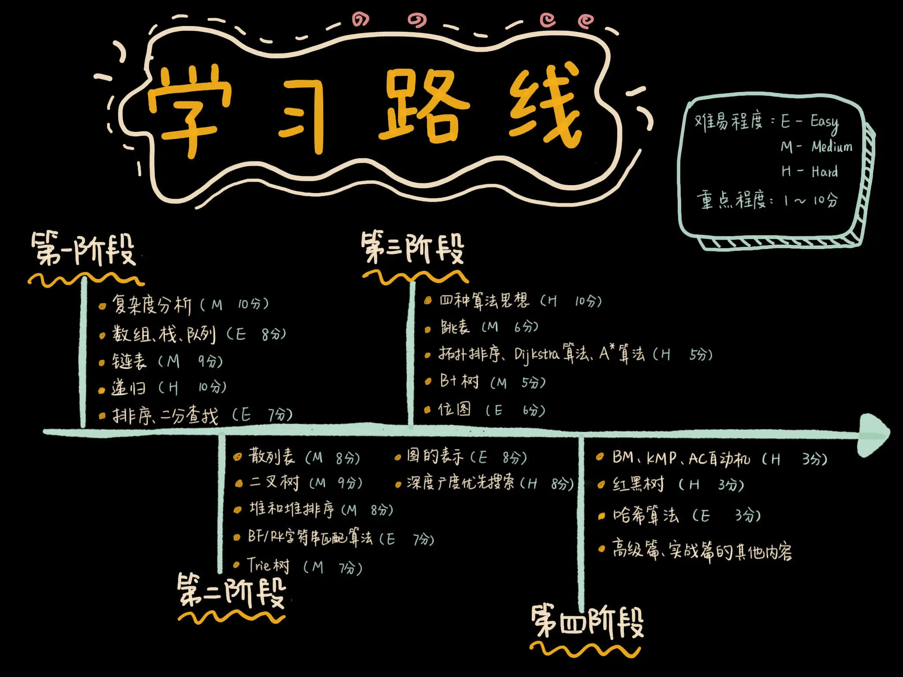

<!--ts-->

数据结构与算法之美

> **原著代码实现:** https://github.com/wangzheng0822/algo   
> **课程资料来源:** 极客时间-《数据结构与算法之美》 王争                    
> **算法课程的思维导图一览**
> 

## 面试掌握顺序：
学习路线：

- part_01 入门知识准备
  - 01_什么是算法
  - 02_如何去衡量算法的优劣
  - 03_复杂度分析点

- part_02 基础篇
  - 01_数组
  - 02_链表
  - 03_栈
  - 04_队列   
  - 05_递归   
  - 06_排序    
  - 07_查找-二分查找
  - 08_查找-跳表查找
  - 09_散列表
  - 10_哈希算法
  - 11_二叉树 （需学习）
  - 12_红黑树
  - 13_堆     （需学习）
  
  

<!--te-->