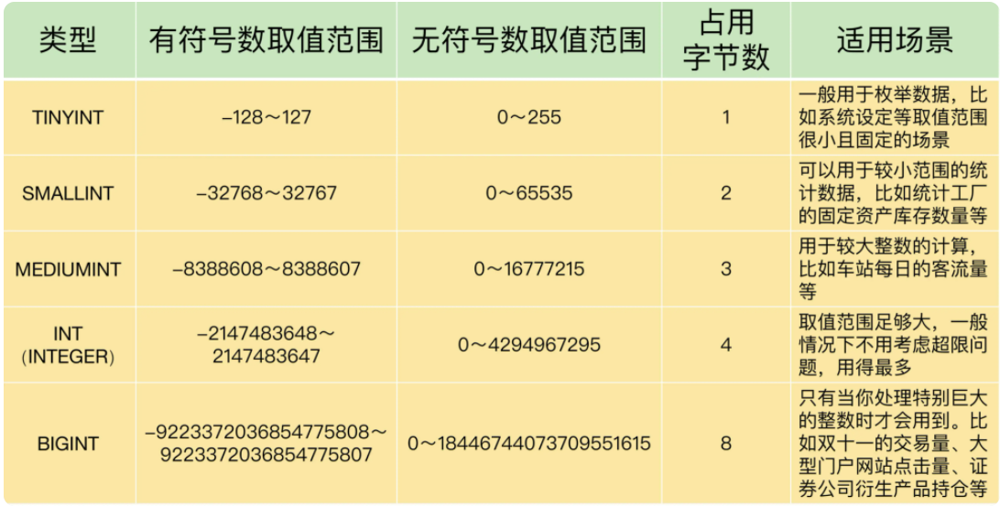

### 1.字段：这么多字段类型，该怎么定义？
- 1.整数类型
  
- 2.浮点数类型和定点数类型
  - 2.1 浮点数类型
    - FLOAT 表示单精度浮点数；
    - DOUBLE 表示双精度浮点数；
    - REAL 默认就是 DOUBLE。如果你把 SQL 模式设定为启用“REAL_AS_FLOAT”，那么，MySQL 就认为 REAL 是 FLOAT。如果要启用“REAL_AS_FLOAT”，就可以通过以下 SQL 语句实现
    ```
    SET sql_mode = “REAL_AS_FLOAT”;
    ```
    
  - 2.2 定点数类型
    - DECIMAL
    MySQL 用 DECIMAL（M,D）的方式表示高精度小数。其中，M 表示整数部分加小数部分，一共有多少位，M<=65。D 表示小数部分位数，D
  > 1.浮点数存在的问题，数据不精准，出现问题的原因：   
    MySQL 用 4 个字节存储 FLOAT 类型数据，用 8 个字节来存储 DOUBLE 类型数据。无论哪个，都是采用二进制的方式来进行存储的。比如 9.625，用二进制来表达，就是 1001.101，或者表达成 1.001101×2^3。看到了吗？如果尾数不是 0 或 5（比如 9.624），
    你就无法用一个二进制数来精确表达。怎么办呢？就只好在取值允许的范围内进行近似（四舍五入）    
    现在你一定明白了，为什么数据类型是 DOUBLE 的时候，我们得到的结果误差更小一些，而数据类型是 FLOAT 的时候，误差会更大一下。原因就是，DOUBLE 有 8 位字节，精度更高。    
    DECIMAL 则不同，它是把十进制数的整数部分和小数部分拆开，分别转换成十六进制数，进行存储。这样，所有的数值，就都可以精准表达了，不会存在因为无法表达而损失精度的问题                                                                                                                                                                                                                                                                                                                                                                                                                                                                                                                                                                                                                                                                                                                                                                            
- 3.文本类型
  - 3.1 CHAR(M)：固定长度字符串。CHAR(M) 类型必须预先定义字符串长度。如果太短，数据可能会超出范围；如果太长，又浪费存储空间。
  - 3.2 VARCHAR(M)： 可变长度字符串。VARCHAR(M) 也需要预先知道字符串的最大长度，不过只要不超过这个最大长度，具体存储的时候，是按照实际字符串长度存储的。
  - 3.3 TEXT：字符串。系统自动按照实际长度存储，不需要预先定义长度。
    因为不需要预先知道字符串的长度，系统会按照实际的数据长度进行存储，所以 TEXT 类型最为灵活方便,TEXT 类型也有 4 种，它们的区别就是最大长度不同。
      - TINYTEXT：255 字符（这里假设字符是 ASCII 码，一个字符占用一个字节，下同）。
      - TEXT： 65535 字符。
      - MEDIUMTEXT：16777215 字符。
      - LONGTEXT： 4294967295 字符（相当于 4GB）
  - 3.4 ENUM： 枚举类型，取值必须是预先设定的一组字符串值范围之内的一个，必须要知道字符串所有可能的取值。
  - 3.5 SET：是一个字符串对象，取值必须是在预先设定的字符串值范围之内的 0 个或多个，也必须知道字符串所有可能的取值。   
  对于 ENUM 类型和 SET 类型来说，你必须知道所有可能的取值，所以只能用在某些特定场合，比如某个参数设定的取值范围只有几个固定值的场景。
  不过，需要注意的是，TEXT 也有一个问题：由于实际存储的长度不确定，MySQL 不允许 TEXT 类型的字段做主键。遇到这种情况，你只能采用 CHAR(M)，或者 VARCHAR(M)
  
- 4.日期与时间类型
      
    为了确保数据的完整性和系统的稳定性，优先考虑使用 DATETIME 类型。因为虽然 DATETIME 类型占用的存储空间最多，但是它表达的时间最为完整，取值范围也最大。
---

### 2.索引
从字段划分分类：
    单字段索引
    组合字段索引
从叶节点上存的数据分类：
    聚集索引
    非聚集索引
#### 单索引
- 1.创建单字段索引
  - 你可以通过 CREATE 语句直接给已经存在的表创建索引，这种方式比较简单，我就不多解释了；
    ```
    CREATE INDEX 索引名 ON TABLE 表名 (字段);
    ```
  - 可以在创建表的同时创建索引；
    ```
    CREATE TABLE 表名
    (
    字段 数据类型,
    ….
    { INDEX | KEY } 索引名(字段)
    )
    ```
  - 可以通过修改表来创建索引。
    ```  
    ALTER TABLE 表名 ADD { INDEX | KEY } 索引名 (字段);
    ```
  > 给表设定主键约束或者唯一性约束的时候，MySQL 会自动创建主键索引或唯一性索引
- 2.单字段索引的作用原理      
  - EXPLAIN 关键字能够查看 SQL 语句的执行细节，包括表的加载顺序，表是如何连接的，以及索引使用情况等
   ```
   mysql> EXPLAIN SELECT   
   -> quantity,price,transdate   
   -> FROM   
   -> demo.trans      
   -> WHERE    
   -> transdate > '2020-12-12'
   -> AND transdate < '2020-12-13'
   -> AND itemnumber = 100;       
   +----+-------------+-------------+------------+-------+-------------------+-------------------+---------+------+------+----------+----------+
   | id | select_type | table | partitions | type | possible_keys | key | key_len | ref | rows | filtered | Extra |
   +----+-------------+-------------+------------+-------+-------------------+-------------------+---------+------+------+----------+----------+
   | 1 | SIMPLE | trans | NULL | range | index_trans | index_trans | 6 | NULL | 5411 | 10.00 | Using index condition; Using where; Using MRR |
   +----+-------------+-------------+------------+-------+-------------------+-------------------+---------+------+------+----------+----------+
   1 row in set, 1 warning (0.00 sec) 
   ```
     - type=range：表示使用索引查询特定范围的数据记录。
     - rows=5411：表示需要读取的记录数。
     - possible_keys=index_trans：表示可以选择的索引是 index_trans。
     - key=index_trans：表示实际选择的索引是 index_trans。
     - extra=Using index condition;Using where;Using MRR：这里面的信息对 SQL 语句的执行细节做了进一步的解释，包含了 3 层含义：第一个是执行时使用了索引，
       第二个是执行时通过 WHERE 条件进行了筛选，第三个是使用了顺序磁盘读取的策略
- 3.如何选择索引字段？   
  要选择那些经常被用做筛选条件的字段     
  如果有多个索引，而这些索引的字段同时作为筛选字段出现在查询中的时候，MySQL 会选择使用最优的索引来执行查询操作
#### 组合索引
- 1.组合索引
  MySQL 最多支持由 16 个字段组成的组合索引
- 2.创建组合索引
  创建组合索引的语法结构与创建单字段索引相同，不同的是相比单字段索引，组合索引使用了多个字段。
  比如直接给数据表创建索引的语法如下：
  ```
  CREATE INDEX 索引名 ON TABLE 表名 (字段1，字段2，...);
  ```
- 2.组合索引的原理
    - 组合索引的多个字段是有序的，遵循左对齐的原则     
    - 筛选的条件也要遵循从左向右的原则，如果中断，那么，断点后面的条件就没有办法利用索引了           
    - 类似的，如果筛选的是一个范围，如果没有办法无法精确定位，也相当于中断。比如“A > 10 AND B = 1 AND C = 100”这个条件，
    只能用到组合索引中 A >10 的部分，后面的索引就都用不上了

#### 删除索引
- 如果你要删除索引，就可以用：
  ```  
  DROP INDEX 索引名 ON 表名;
  ```
- 当然， 有的索引不能用这种方法删除，比如主键索引，你就必须通过修改表来删除索引：
  ```   
  ALTER TABLE 表名 DROP PRIMARY KEY；
  ```

#### 索引开销
- 索引能够提升查询的效率，但是建索引也是有成本的，主要有 2 个方面，一个存储空间的开销，还有一个是数据操作上的开销
  - 存储空间的开销，是指索引需要单独占用存储空间。
  - 数据操作上的开销，是指一旦数据表有变动，无论是插入一条新数据，还是删除一条旧的数据，甚至是修改数据，如果涉及索引字段，都需要对索引本身进行修改，以确保索引能够指向正确的记录
 
  
          
### 总结
在定义数据类型时，如果确定是整数，就用 INT；如果是小数，一定用定点数类型 DECIMAL；如果是字符串，只要不是主键，就用 TEXT；如果是日期与时间，就用 DATETIME。


