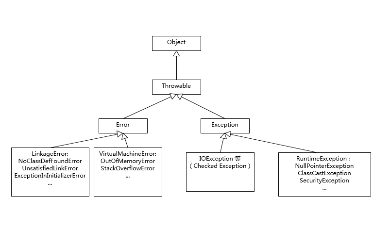

> **课程资料来源:** 极客时间-《Java 核心技术面试精讲》 杨晓峰

### 1.谈谈你对JAVA的理解
java是一个面向对象，跨平台，实现了垃圾自动回收的开发语言，它之所以能够跨平台，是因为在不同的操作系统需要提前安装对应操作系统的JVM
另外在目前的主流的JDK版本中，如 JDK 8 实际是解释和编译混合的一种模式，提供了 JIT（Just-In-Time）编译器，JIT 能够在运行时将热点
代码编译成机器码，这种情况下部分热点代码就属于编译执行，而不是解释执行了。

---
### 2.Exception和Error有啥区别
Exception和Error都继承了Throwable类
Exception是程序正常运行中，可能出现的情况，应该予以处理，处理方式：1.捕获 try……catch  2.向上抛出 3.交由JVM处理


- 异常处理的基本原则
  - 1.尽量不要捕获类似 Exception 这样的通用异常，而是应该捕获特定异常    
  泛泛的 Exception 之类，恰恰隐藏了我们的目的。另外，我们也要保证程序不会捕获到我们不希望捕获的异常。比如，你可能更希望 RuntimeException 被扩散出来，而不是被捕获
  - 2.不要生吞（swallow）异常
  生吞异常，往往是基于假设这段代码可能不会发生，或者感觉忽略异常是无所谓的，但是千万不要在产品代码做这种假设！好的方式：
  使用产品日志，详细地输出到日志系统里
  - 3.Throw early, catch late
  例如以下❌代码
    ```
    public void readPreferences(String fileName){
     //...perform operations... 
    InputStream in = new FileInputStream(fileName);
     //...read the preferences file...
    }
    ```
    如果 fileName 是 null，那么程序就会抛出 NullPointerException，但是由于没有第一时间暴露出问题，堆栈信息可能非常令人费解，往往需要相对复杂的定位    
  正确代码：
    ``` 
    public void readPreferences(String filename) {
    Objects. requireNonNull(filename);
    //...perform other operations... 
    InputStream in = new FileInputStream(filename);
    //...read the preferences file...
    }
    ```
- Java 的异常处理机制对性能的影响:
  - 1.try-catch 代码段会产生额外的性能开销，或者换个角度说，它往往会影响 JVM 对代码进行优化，所以建议仅捕获有必要的代码段，尽量不要一个大的 try 包住整段的代码；与此同时，
  利用异常控制代码流程，也不是一个好主意，远比我们通常意义上的条件语句（if/else、switch）要低效        
  - 2.Java 每实例化一个 Exception，都会对当时的栈进行快照，这是一个相对比较重的操作。如果发生的非常频繁，这个开销可就不能被忽略了
---

### 3.谈谈final，finally，finalize有什么不同
- final 可以用来修饰类、方法、变量，分别有不同的意义，final 修饰的 class 代表不可以继承扩展，final 的变量是不可以修改的，而 final 的方法也是不可以重写的（override）   
- finally 则是 Java 保证重点代码一定要被执行的一种机制。我们可以使用 try-finally 或者 try-catch-finally 来进行类似关闭 JDBC 连接、保证 unlock 锁等动作   
- finalize 是基础类 java.lang.Object 的一个方法，它的设计目的是保证对象在被垃圾收集前完成特定资源的回收。finalize 机制现在已经不推荐使用，并且在 JDK 9 开始被标记为 deprecated
> - final的好处
>   - 使用 final 修饰参数或者变量，也可以清楚地避免意外赋值导致的编程错误，甚至，有人明确推荐将所有方法参数、本地变量、成员变量声明成 final    
>   - final 变量产生了某种程度的不可变（immutable）的效果，所以，可以用于保护只读数据，尤其是在并发编程中，因为明确地不能再赋值 final 变量，有利于减少额外的同步开销，也可以省去一些防御性拷贝的必要
> - 关于finally
>   - 更推荐使用 Java 7 中添加的 try-with-resources 语句，因为通常 Java 平台能够更好地处理异常情况，编码量也要少很多，何乐而不为呢
> - 为什么finalize被弃用
>   - 你无法保证 finalize 什么时候执行，执行的是否符合预期。使用不当会影响性能，导致程序死锁、挂起等。
#### 3.1 final 不是 immutable
比如如下代码：
```
 final List<String> strList = new ArrayList<>();
 strList.add("Hello");
 strList.add("world");  
 List<String> unmodifiableStrList = List.of("hello", "world");
 unmodifiableStrList.add("again");
```
final 只能约束 strList 这个引用不可以被赋值，但是 strList 对象行为不被 final 影响，添加元素等操作是完全正常的。如果我们真的希望对象本身是不可变的，那么需要相应的类支持不可变的行为。在上面这个例子中，
List.of 方法创建的本身就是不可变 List，最后那句 add 是会在运行时抛出异常的    

> Immutable 在很多场景是非常棒的选择，某种意义上说，Java 语言目前并没有原生的不可变支持，如果要实现 immutable 的类，我们需要做到:
>   - 将 class 自身声明为 final，这样别人就不能扩展来绕过限制了。
>   - 将所有成员变量定义为 private 和 final，并且不要实现 setter 方法。
>   - 通常构造对象时，成员变量使用深度拷贝来初始化，而不是直接赋值，这是一种防御措施，因为你无法确定输入对象不被其他人修改。
>   - 如果确实需要实现 getter 方法，或者其他可能会返回内部状态的方法，使用 copy-on-write 原则，创建私有的 copy

#### 3.2 有什么机制可以替换 finalize 吗?
Java 平台目前在逐步使用 java.lang.ref.Cleaner 来替换掉原有的 finalize 实现。Cleaner 的实现利用了幻象引用（PhantomReference），这是一种常见的所谓 post-mortem 清理机制

### 4.强引用、软引用、弱引用、幻象引用有什么区别？
- 1 强引用
特点：我们平常典型编码Object obj = new Object()中的obj就是强引用。通过关键字new创建的对象所关联的引用就是强引用。 当JVM内存空间不足，JVM宁愿抛出OutOfMemoryError运行时错误（OOM），使程序异常终止，也不会靠随意回收具有强引用的“存活”对象来解决内存不足的问题。对于一个普通的对象，如果没有其他的引用关系，只要超过了引用的作用域或者显式地将相应（强）引用赋值为 null，就是可以被垃圾收集的了，具体回收时机还是要看垃圾收集策略。
- 2 软引用
特点：软引用通过SoftReference类实现。 软引用的生命周期比强引用短一些。只有当 JVM 认为内存不足时，才会去试图回收软引用指向的对象：即JVM 会确保在抛出 OutOfMemoryError 之前，清理软引用指向的对象。软引用可以和一个引用队列（ReferenceQueue）联合使用，如果软引用所引用的对象被垃圾回收器回收，Java虚拟机就会把这个软引用加入到与之关联的引用队列中。后续，我们可以调用ReferenceQueue的poll()方法来检查是否有它所关心的对象被回收。如果队列为空，将返回一个null,否则该方法返回队列中前面的一个Reference对象。
应用场景：软引用通常用来实现内存敏感的缓存。如果还有空闲内存，就可以暂时保留缓存，当内存不足时清理掉，这样就保证了使用缓存的同时，不会耗尽内存。
- 3 弱引用
弱引用通过WeakReference类实现。 弱引用的生命周期比软引用短。在垃圾回收器线程扫描它所管辖的内存区域的过程中，一旦发现了具有弱引用的对象，不管当前内存空间足够与否，都会回收它的内存。由于垃圾回收器是一个优先级很低的线程，因此不一定会很快回收弱引用的对象。弱引用可以和一个引用队列（ReferenceQueue）联合使用，如果弱引用所引用的对象被垃圾回收，Java虚拟机就会把这个弱引用加入到与之关联的引用队列中。
应用场景：弱应用同样可用于内存敏感的缓存。
- 4 虚引用
特点：虚引用也叫幻象引用，通过PhantomReference类来实现。无法通过虚引用访问对象的任何属性或函数。幻象引用仅仅是提供了一种确保对象被 finalize 以后，做某些事情的机制。如果一个对象仅持有虚引用，那么它就和没有任何引用一样，在任何时候都可能被垃圾回收器回收。虚引用必须和引用队列 （ReferenceQueue）联合使用。当垃圾回收器准备回收一个对象时，如果发现它还有虚引用，就会在回收对象的内存之前，把这个虚引用加入到与之关联的引用队列中。
ReferenceQueue queue = new ReferenceQueue ();
PhantomReference pr = new PhantomReference (object, queue);
程序可以通过判断引用队列中是否已经加入了虚引用，来了解被引用的对象是否将要被垃圾回收。如果程序发现某个虚引用已经被加入到引用队列，那么就可以在所引用的对象的内存被回收之前采取一些程序行动。
应用场景：可用来跟踪对象被垃圾回收器回收的活动，当一个虚引用关联的对象被垃圾收集器回收之前会收到一条系统通知。

### 5.String、StringBuffer、StringBuilder有什么区别？
 - 1.String是immutable的典型实现，当通过String str = '字符串'的方式创建一个字符串时，此时的str会去字符串常量池当中寻找，如果有则将str指向该引用，没有则会缓存到常量池当中，但是这样
 创建的字符串在jdk6以下的版本当中，由于字符串常量池缓存有大量的字符串，其位于永久代，不会被垃圾回收期所回收，所以可能会导致OOM异常，这个问题在之后的jdk版本中通过原空间的方式得到了处理。
 而直接new出来的字符串，则会直接进行字符串对象创建
 - 2.StringBuffer是线程安全的可变字符串，StringBuilder是线程不安全的可变字符串
 - 3.