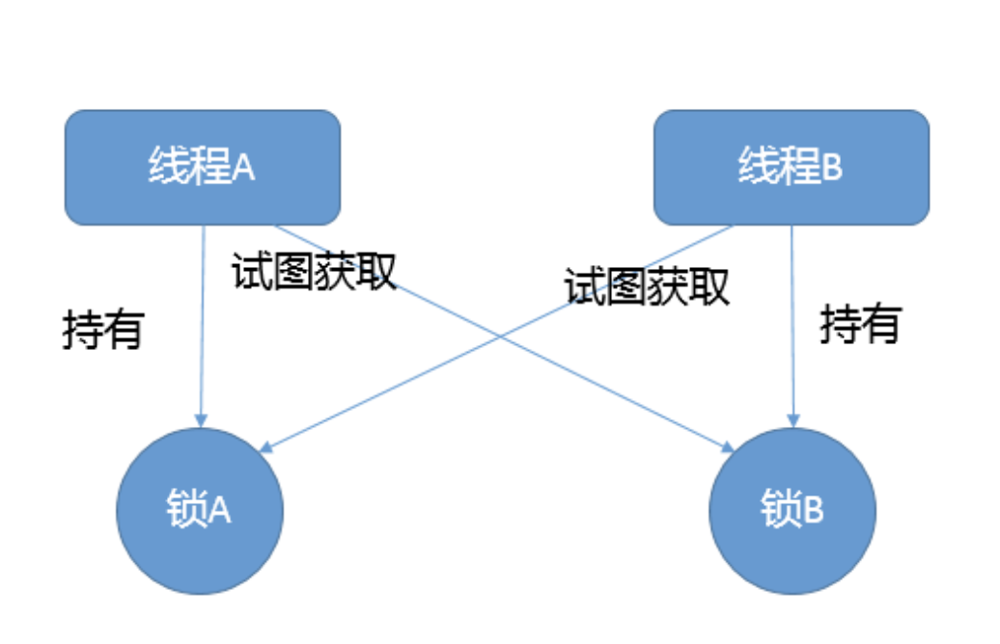

> **课程资料来源:** 极客时间-《Java 核心技术面试精讲》 杨晓峰

### 1.Synchronized和ReentrantLock有什么区别？
- Synchronized是Java内建的同步机制，它提供了互斥性的语义和可见性，当一个线程已经获取当前锁时，其他试图获取的线程只能阻塞在那里。
- 在Jdk5以前，Synchronized是仅有的同步手段，它可以用来修饰方法，也可以作用在特定的代码块上，本质上Synchronized作用的方法相当于
把放大全部用Synchronized块包起来。（JDK5之后出现了ReentrantLock）
- ReentrantLock，通常翻译为再入锁，是Jdk5提供的锁实现，再入锁通过代码直接调用lock()来获得锁，与此同时，ReentrantLock提供了很多
实用的方法，比如Synchronized无法做到的细节控制，比如可以控制公平性，同时，其释放锁的方式是通过unlock()方法来释放
- 在早期的版本中synchronized与ReentrantLock性能差异较大，但在后期版本中，对于低竞争场景下Synchronized性能可能优于ReentrantLock。

> 线程安全需要保证几个基本特性：
>  - 原子性，简单说就是相关操作不会中途被其他线程干扰，一般通过同步机制实现。
>  - 可见性，是一个线程修改了某个共享变量，其状态能够立即被其他线程知晓，通常被解释为将线程本地状态反映到主内存上，volatile 就是负责保证可见性的。
>  - 有序性，是保证线程内串行语义，避免指令重排等。
---

### 2.Synchronized底层是如何实现的，什么是锁的升级和降级？
- Synchronized代码块是由一对儿monitorenter/monitorexit指令实现的，Monitor对象是同步的基本实现
- 在 Java 6 之前，Monitor 的实现完全是依靠操作系统内部的互斥锁，因为需要进行用户态到内核态的切换，所以同步操作是一个无差别的重量级操作。
- 现代的（Oracle）JDK 中，JVM 对此进行了大刀阔斧地改进，提供了三种不同的 Monitor 实现，也就是常说的三种不同的锁：偏斜锁（Biased Locking）、轻量级锁和重量级锁，大大改进了其性能。
- 所谓锁的升级、降级，就是 JVM 优化 synchronized 运行的机制，当 JVM 检测到不同的竞争状况时，会自动切换到适合的锁实现，这种切换就是锁的升级、降级
- 当没有竞争出现时，默认会使用偏斜锁。JVM 会利用 CAS 操作（compare and swap），在对象头上的 Mark Word 部分设置线程 ID，以表示这个对象偏向于当前线程，所以并不涉及真正的互斥锁。
  这样做的假设是基于在很多应用场景中，大部分对象生命周期中最多会被一个线程锁定，使用偏斜锁可以降低无竞争开销。
- 如果有另外的线程试图锁定某个已经被偏斜过的对象，JVM 就需要撤销（revoke）偏斜锁，并切换到轻量级锁实现。轻量级锁依赖 CAS 操作 Mark Word 来试图获取锁，如果重试成功，就使用普通的轻量级锁；
  否则，进一步升级为重量级锁。
- 我注意到有的观点认为 Java 不会进行锁降级。实际上据我所知，锁降级确实是会发生的，当 JVM 进入安全点（SafePoint）的时候，会检查是否有闲置的 Monitor，然后试图进行降级

> 自旋锁:竞争锁的失败的线程，并不会真实的在操作系统层面挂起等待，而是JVM会让线程做几个空循环(基于预测在不久的将来就能获得)，在经过若干次循环后，如果可以获得锁，那么进入临界区，如果还不能获得锁，
> 才会真实的将线程在操作系统层面进行挂起。     
> **适用场景:** 自旋锁可以减少线程的阻塞，这对于锁竞争不激烈，且占用锁时间非常短的代码块来说，有较大的性能提升，因为自旋的消耗会小于线程阻塞挂起操作的消耗。
  如果锁的竞争激烈，或者持有锁的线程需要长时间占用锁执行同步块，就不适合使用自旋锁了，因为自旋锁在获取锁前一直都是占用cpu做无用功，线程自旋的消耗大于线程阻塞挂起操作的消耗，造成cpu的浪费。
--- 

### 3.一个线程两次调用 start() 方法会出现什么情况？谈谈线程的生命周期和状态转移。
- Java 的线程是不允许启动两次的，第二次调用必然会抛出 IllegalThreadStateException，这是一种运行时异常，多次调用 start 被认为是编程错误。
关于线程生命周期的不同状态，在 Java 5 以后，线程状态被明确定义在其公共内部枚举类型 java.lang.Thread.State 中，分别是：
  - 新建（NEW），表示线程被创建出来还没真正启动的状态，可以认为它是个 Java 内部状态。
  - 就绪（RUNNABLE），表示该线程已经在 JVM 中执行，当然由于执行需要计算资源，它可能是正在运行，也可能还在等待系统分配给它 CPU 片段，在就绪队列里面排队。
    在其他一些分析中，会额外区分一种状态 RUNNING，但是从 Java API 的角度，并不能表示出来。
  - 阻塞（BLOCKED），这个状态和我们前面两讲介绍的同步非常相关，阻塞表示线程在等待 Monitor lock。比如，线程试图通过 synchronized 去获取某个锁，但是其他线程已经独占了，那么当前线程就会处于阻塞状态。等待（WAITING），表示正在等待其他线程采取某些操作。一个常见的场景是类似生产者消费者模式，发现任务条件尚未满足，就让当前消费者线程等待（wait），另外的生产者线程去准备任务数据，然后通过类似 notify 等动作，通知消费线程可以继续工作了。Thread.join() 也会令线程进入等待状态。
  - 计时等待（TIMED_WAIT），其进入条件和等待状态类似，但是调用的是存在超时条件的方法，比如 wait 或 join 等方法的指定超时版本，如下面示例：
  - 终止（TERMINATED），不管是意外退出还是正常执行结束，线程已经完成使命，终止运行，也有人把这个状态叫作死亡。
  在第二次调用 start() 方法的时候，线程可能处于终止或者其他（非 NEW）状态，但是不论如何，都是不可以再次启动的。
---

### 4.什么情况下Java程序会产生死锁？如何定位、修复？
- 死锁是一种特定的程序状态，在实体之间，由于循环依赖导致彼此一直处于等待之中，没有任何个体可以继续前进。死锁不仅仅是在线程之间会发生，存在资源独占的进程之间同样也可能出现死锁。通常来说，我们大多是聚焦在多线程场景中的死锁，指两个或多个线程之间，由于互相持有对方需要的锁，而永久处于阻塞的状态。
你可以利用下面的示例图理解基本的死锁问题：

定位死锁最常见的方式就是利用 jstack 等工具获取线程栈，然后定位互相之间的依赖关系，进而找到死锁。如果是比较明显的死锁，往往 jstack 等就能直接定位，类似 JConsole 甚至可以在图形界面进行有限的死锁检测。
如果程序运行时发生了死锁，绝大多数情况下都是无法在线解决的，只能重启、修正程序本身问题。所以，代码开发阶段互相审查，或者利用工具进行预防性排查，往往也是很重要的。

### 5.Java 并发包提供了哪些并发工具类？
我们通常所说的并发包也就是 java.util.concurrent 及其子包，集中了 Java 并发的各种基础工具类，具体主要包括几个方面：
- 提供了比 synchronized 更加高级的各种同步结构，包括 CountDownLatch、CyclicBarrier、Semaphore 等，可以实现更加丰富的多线程操作，比如利用 Semaphore 作为资源控制器，限制同时进行工作的线程数量
> CountDownLatch，允许一个或多个线程等待某些操作完成。
> CyclicBarrier，一种辅助性的同步结构，允许多个线程等待到达某个屏障。
> Semaphore，Java 版本的信号量实现。(它通过控制一定数量的允许（permit）的方式，来达到限制通用资源访问的目的)
- 各种线程安全的容器，比如最常见的 ConcurrentHashMap、有序的 ConcurrentSkipListMap，或者通过类似快照机制，实现线程安全的动态数组 CopyOnWriteArrayList 等
- 各种并发队列实现，如各种 BlockingQueue 实现，比较典型的 ArrayBlockingQueue、 SynchronousQueue 或针对特定场景的 PriorityBlockingQueue 等。
- 强大的 Executor 框架，可以创建各种不同类型的线程池，调度任务运行等，绝大部分情况下，不再需要自己从头实现线程池和任务调度器。
---

### 6.并发包中的ConcurrentLinkedQueue和LinkedBlockingQueue有什么区别？
有时候我们把并发包下面的所有容器都习惯叫作并发容器，但是严格来讲，类似 ConcurrentLinkedQueue 这种“Concurrent*”容器，才是真正代表并发。
关于问题中它们的区别:
- Concurrent 类型基于 lock-free，在常见的多线程访问场景，一般可以提供较高吞吐量。
- 而 LinkedBlockingQueue 内部则是基于锁，并提供了 BlockingQueue 的等待性方法。
不知道你有没有注意到，java.util.concurrent 包提供的容器（Queue、List、Set）、Map，从命名上可以大概区分为 Concurrent*、CopyOnWrite和 Blocking等三类，同样是线程安全容器，可以简单认为：
- Concurrent 类型没有类似 CopyOnWrite 之类容器相对较重的修改开销。
- 但是，凡事都是有代价的，Concurrent 往往提供了较低的遍历一致性。你可以这样理解所谓的弱一致性，例如，当利用迭代器遍历时，如果容器发生修改，迭代器仍然可以继续进行遍历。
- 与弱一致性对应的，就是我介绍过的同步容器常见的行为“fail-fast”，也就是检测到容器在遍历过程中发生了修改，则抛出 ConcurrentModificationException，不再继续遍历。
- 弱一致性的另外一个体现是，size 等操作准确性是有限的，未必是 100% 准确。
- 与此同时，读取的性能具有一定的不确定性。
---

### 7.Java并发类库提供的线程池有哪几种？ 分别有什么特点？
通常开发者都是利用 Executors 提供的通用线程池创建方法，去创建不同配置的线程池，主要区别在于不同的 ExecutorService 类型或者不同的初始参数:
Executors 目前提供了 5 种不同的线程池创建配置：
- newCachedThreadPool()，它是一种用来处理大量短时间工作任务的线程池，具有几个鲜明特点：它会试图缓存线程并重用，当无缓存线程可用时，就会创建新的工作线程；如果线程闲置的时间超过 60 秒，则被终止并移出缓存；
  长时间闲置时，这种线程池，不会消耗什么资源。其内部使用 SynchronousQueue 作为工作队列。
- newFixedThreadPool(int nThreads)，重用指定数目（nThreads）的线程，其背后使用的是无界的工作队列，任何时候最多有 nThreads 个工作线程是活动的。这意味着，如果任务数量超过了活动队列数目，将在工作队列中等待空闲线程出现；
  如果有工作线程退出，将会有新的工作线程被创建，以补足指定的数目 nThreads。
- newSingleThreadExecutor()，它的特点在于工作线程数目被限制为 1，操作一个无界的工作队列，所以它保证了所有任务的都是被顺序执行，最多会有一个任务处于活动状态，并且不允许使用者改动线程池实例，因此可以避免其改变线程数目。
- newSingleThreadScheduledExecutor() 和 newScheduledThreadPool(int corePoolSize)，创建的是个 ScheduledExecutorService，可以进行定时或周期性的工作调度，区别在于单一工作线程还是多个工作线程。
- newWorkStealingPool(int parallelism)，这是一个经常被人忽略的线程池，Java 8 才加入这个创建方法，其内部会构建ForkJoinPool，利用Work-Stealing算法，并行地处理任务，不保证处理顺序。
---

### 8.AtomicInteger底层实现原理是什么？如何在自己的产品代码中应用CAS操作？
AtomicIntger 是对 int 类型的一个封装，提供原子性的访问和更新操作，其原子性操作的实现是基于 CAS（compare-and-swap）技术。   
所谓 CAS，表征的是一系列操作的集合，获取当前数值，进行一些运算，利用 CAS 指令试图进行更新。如果当前数值未变，代表没有其他线程进行并发修改，则成功更新。否则，可能出现不同的选择，要么进行重试，要么就返回一个成功或者失败的结果。
从 AtomicInteger 的内部属性可以看出，它依赖于 Unsafe 提供的一些底层能力，进行底层操作；以 volatile 的 value 字段，记录数值，以保证可见性。
```
private static final jdk.internal.misc.Unsafe U = jdk.internal.misc.Unsafe.getUnsafe();
private static final long VALUE = U.objectFieldOffset(AtomicInteger.class, "value");
private volatile int value;
```
具体的原子操作细节，可以参考任意一个原子更新方法，比如下面的 getAndIncrement
Unsafe 会利用 value 字段的内存地址偏移，直接完成操作。
```
public final int getAndIncrement() {
    return U.getAndAddInt(this, VALUE, 1);
}
```
因为 getAndIncrement 需要返归数值，所以需要添加失败重试逻辑。
```
public final int getAndAddInt(Object o, long offset, int delta) {
    int v;
    do {
        v = getIntVolatile(o, offset);
    } while (!weakCompareAndSetInt(o, offset, v, v + delta));
    return v;
}
```
而类似 compareAndSet 这种返回 boolean 类型的函数，因为其返回值表现的就是成功与否，所以不需要重试。
```
public final boolean compareAndSet(int expectedValue, int newValue)
```
CAS 是 Java 并发中所谓 lock-free 机制的基础。

---

### 9.请介绍类加载过程，什么是双亲委派模型？
一般来说，我们把 Java 的类加载过程分为三个主要步骤：加载、链接、初始化，具体行为在Java 虚拟机规范里有非常详细的定义。
首先是加载阶段（Loading），它是 Java 将字节码数据从不同的数据源读取到 JVM 中，并映射为 JVM 认可的数据结构（Class 对象），这里的数据源可能是各种各样的形态，如 jar 文件、class 文件，甚至是网络数据源等;
如果输入数据不是 ClassFile 的结构，则会抛出ClassFormatError。           
加载阶段是用户参与的阶段，我们可以自定义类加载器，去实现自己的类加载过程。     
第二阶段是链接（Linking），这是核心的步骤，简单说是把原始的类定义信息平滑地转化入 JVM 运行的过程中。这里可进一步细分为三个步骤：
 - 验证（Verification），这是虚拟机安全的重要保障，JVM 需要核验字节信息是符合 Java 虚拟机规范的，否则就被认为是 VerifyError，这样就防止了恶意信息或者不合规的信息危害 JVM 的运行，验证阶段有可能触发更多 class 的加载。
 - 准备（Preparation），创建类或接口中的静态变量，并初始化静态变量的初始值。但这里的“初始化”和下面的显式初始化阶段是有区别的，侧重点在于分配所需要的内存空间，不会去执行更进一步的 JVM 指令。
 - 解析（Resolution），在这一步会将常量池中的符号引用（symbolic reference）替换为直接引用。在Java 虚拟机规范中，详细介绍了类、接口、方法和字段等各个方面的解析。
最后是初始化阶段（initialization），这一步真正去执行类初始化的代码逻辑，包括静态字段赋值的动作，以及执行类定义中的静态初始化块内的逻辑，编译器在编译阶段就会把这部分逻辑整理好，父类型的初始化逻辑优先于当前类型的逻辑。    
再来谈谈双亲委派模型，简单说就是当类加载器（Class-Loader）试图加载某个类型的时候，除非父加载器找不到相应类型，否则尽量将这个任务代理给当前加载器的父加载器去做。使用委派模型的目的是避免重复加载 Java 类型。
---

### 10.有哪些方法可以在运行时动态生成一个Java类？ 
我们可以从常见的 Java 类来源分析，通常的开发过程是，开发者编写 Java 代码，调用 javac 编译成 class 文件，然后通过类加载机制载入 JVM，就成为应用运行时可以使用的 Java 类了。   
从上面过程得到启发，其中一个直接的方式是从源码入手，可以利用 Java 程序生成一段源码，然后保存到文件等，下面就只需要解决编译问题了。    
有一种笨办法，直接用 ProcessBuilder 之类启动 javac 进程，并指定上面生成的文件作为输入，进行编译。最后，再利用类加载器，在运行时加载即可。    
前面的方法，本质上还是在当前程序进程之外编译的，那么还有没有不这么 low 的办法呢？       
你可以考虑使用 Java Compiler API，这是 JDK 提供的标准 API，里面提供了与 javac 对等的编译器功能，具体请参考java.compiler相关文档。        
进一步思考，我们一直围绕 Java 源码编译成为 JVM 可以理解的字节码，换句话说，只要是符合 JVM 规范的字节码，不管它是如何生成的，是不是都可以被 JVM 加载呢？我们能不能直接生成相应的字节码，然后交给类加载器去加载呢？        
当然也可以，不过直接去写字节码难度太大，通常我们可以利用 Java 字节码操纵工具和类库来实现，比如在专栏第 6 讲中提到的ASM、Javassist、cglib 等。
---

### 11.


### Java常见的垃圾收集器有哪些？

### 谈谈你的GC调优思路?

### Java程序运行在Docker等容器环境有哪些新问题？


