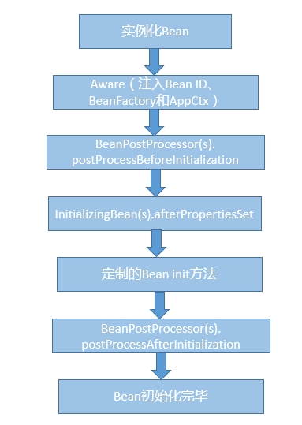

> **课程资料来源:** 极客时间-《Java 核心技术面试精讲》 杨晓峰

### 1.Java应用开发中的注入攻击吗？
注入式（Inject）攻击是一类非常常见的攻击方式，其基本特征是程序允许攻击者将不可信的动态内容注入到程序中，并将其执行，这就可能完全改变最初预计的执行过程，产生恶意效果。   
下面是几种主要的注入式攻击途径，原则上提供动态执行能力的语言特性，都需要提防发生注入攻击的可能。    
首先，就是最常见的 SQL 注入攻击。一个典型的场景就是 Web 系统的用户登录功能，根据用户输入的用户名和密码，我们需要去后端数据库核实信息。      
假设应用逻辑是，后端程序利用界面输入动态生成类似下面的 SQL，然后让 JDBC 执行。      
```
Select * from use_info where username = “input_usr_name” and password = “input_pwd”
```
但是，如果我输入的 input_pwd 是类似下面的文本，
```
“ or “”=”
```
那么，拼接出的 SQL 字符串就变成了下面的条件，OR 的存在导致输入什么名字都是复合条件的。
```
Select * from use_info where username = “input_usr_name” and password = “” or “” = “”
```
这里只是举个简单的例子，它是利用了期望输入和可能输入之间的偏差。上面例子中，期望用户输入一个数值，但实际输入的则是 SQL 语句片段。类似场景可以利用注入的不同 SQL 语句，
进行各种不同目的的攻击，甚至还可以加上“;delete xxx”之类语句，如果数据库权限控制不合理，攻击效果就可能是灾难性的。     
第二，操作系统命令注入。Java 语言提供了类似 Runtime.exec(…) 的 API，可以用来执行特定命令，假设我们构建了一个应用，以输入文本作为参数，执行下面的命令：  
```
ls –la input_file_name
```
但是如果用户输入是 “input_file_name;rm –rf /*”，这就有可能出现问题了。当然，这只是个举例，Java 标准类库本身进行了非常多的改进，所以类似这种编程错误，未必可以真的完成攻击，
但其反映的一类场景是真实存在的。
第三，XML 注入攻击。Java 核心类库提供了全面的 XML 处理、转换等各种 API，而 XML 自身是可以包含动态内容的，例如 XPATH，如果使用不当，可能导致访问恶意内容。
还有类似 LDAP 等允许动态内容的协议，都是可能利用特定命令，构造注入式攻击的，包括 XSS（Cross-site Scripting）攻击，虽然并不和 Java 直接相关，但也可能在 JSP 等动态页面中发生。
---

### 2.如何写出安全的Java代码？
DoS 是一种常见的网络攻击，有人也称其为“洪水攻击”。最常见的表现是，利用大量机器发送请求，将目标网站的带宽或者其他资源耗尽，导致其无法响应正常用户的请求。
我认为，从 Java 语言的角度，更加需要重视的是程序级别的攻击，也就是利用 Java、JVM 或应用程序的瑕疵，进行低成本的 DoS 攻击，这也是想要写出安全的 Java 代码所必须考虑的。例如：
- 如果使用的是早期的 JDK 和 Applet 等技术，攻击者构建合法但恶劣的程序就相对容易，例如，将其线程优先级设置为最高，做一些看起来无害但空耗资源的事情。幸运的是类似技术已经逐步退出历史舞台，
  在 JDK 9 以后，相关模块就已经被移除。
- 上一讲中提到的哈希碰撞攻击，就是个典型的例子，对方可以轻易消耗系统有限的 CPU 和线程资源。从这个角度思考，类似加密、解密、图形处理等计算密集型任务，都要防范被恶意滥用，
  以免攻击者通过直接调用或者间接触发方式，消耗系统资源。
- 利用 Java 构建类似上传文件或者其他接受输入的服务，需要对消耗系统内存或存储的上限有所控制，因为我们不能将系统安全依赖于用户的合理使用。其中特别注意的是涉及解压缩功能时，
  就需要防范Zip bomb等特定攻击。
- 另外，Java 程序中需要明确释放的资源有很多种，比如文件描述符、数据库连接，甚至是再入锁，任何情况下都应该保证资源释放成功，否则即使平时能够正常运行，也可能被攻击者利用而耗尽某类资源，
  这也算是可能的 DoS 攻击来源。
所以可以看出，实现安全的 Java 代码，需要从功能设计到实现细节，都充分考虑可能的安全影响。
---

### 3.后台服务出现明显“变慢”，谈谈你的诊断思路？
首先，需要对这个问题进行更加清晰的定义:
- 服务是突然变慢还是长时间运行后观察到变慢？类似问题是否重复出现？
- “慢”的定义是什么，我能够理解是系统对其他方面的请求的反应延时变长吗?
第二，理清问题的症状，这更便于定位具体的原因，有以下一些思路：
  - 问题可能来自于 Java 服务自身，也可能仅仅是受系统里其他服务的影响。初始判断可以先确认是否出现了意外的程序错误，例如检查应用本身的错误日志。对于分布式系统，很多公司都会实现更加系统的日志、
    性能等监控系统。 一些 Java 诊断工具也可以用于这个诊断，例如通过 JFR（Java Flight Recorder），监控应用是否大量出现了某种类型的异常。如果有，那么异常可能就是个突破点。如果没有，可以先
    检查系统级别的资源等情况，监控 CPU、内存等资源是否被其他进程大量占用，并且这种占用是否不符合系统正常运行状况
  - 监控 Java 服务自身，例如 GC 日志里面是否观察到 Full GC 等恶劣情况出现，或者是否 Minor GC 在变长等；利用 jstat 等工具，获取内存使用的统计信息也是个常用手段；利用 jstack 等工具检查是
    否出现死锁等。
  - 如果还不能确定具体问题，对应用进行 Profiling 也是个办法，但因为它会对系统产生侵入性，如果不是非常必要，大多数情况下并不建议在生产系统进行
  - 定位了程序错误或者 JVM 配置的问题后，就可以采取相应的补救措施，然后验证是否解决，否则还需要重复上面部分过程。
> Profiling-性能监测工具
---

### 4.有人说“Lambda能让Java程序慢30倍”，你怎么看？
为了让你清楚地了解这个背景，请参考下面的代码片段。在实际运行中，基于 Lambda/Stream 的版本（lambdaMaxInteger），比传统的 for-each 版本（forEachLoopMaxInteger）慢很多。
```
// 一个大的ArrayList，内部是随机的整形数据
volatile List<Integer> integers = …
 
// 基准测试1
public int forEachLoopMaxInteger() {
   int max = Integer.MIN_VALUE;
   for (Integer n : integers) {
    max = Integer.max(max, n);
   }
   return max;
}
 
// 基准测试2
public int lambdaMaxInteger() {
   return integers.stream().reduce(Integer.MIN_VALUE, (a, b) -> Integer.max(a, b));
}
```
我认为，“Lambda 能让 Java 程序慢 30 倍”这个争论实际反映了几个方面：    
第一，基准测试是一个非常有效的通用手段，让我们以直观、量化的方式，判断程序在特定条件下的性能表现。  
第二，基准测试必须明确定义自身的范围和目标，否则很有可能产生误导的结果。前面代码片段本身的逻辑就有瑕疵，更多的开销是源于自动装箱、拆箱（auto-boxing/unboxing），而不是源自 Lambda 和 Stream，
所以得出的初始结论是没有说服力的。
第三，虽然 Lambda/Stream 为 Java 提供了强大的函数式编程能力，但是也需要正视其局限性：
 - 一般来说，我们可以认为 Lambda/Stream 提供了与传统方式接近对等的性能，但是如果对于性能非常敏感，就不能完全忽视它在特定场景的性能差异了，例如：初始化的开销。 Lambda 并不算是语法糖，而是一种新的工作机制，
   在首次调用时，JVM 需要为其构建CallSite实例。这意味着，如果 Java 应用启动过程引入了很多 Lambda 语句，会导致启动过程变慢。其实现特点决定了 JVM 对它的优化可能与传统方式存在差异
 - 增加了程序诊断等方面的复杂性，程序栈要复杂很多，Fluent 风格本身也不算是对于调试非常友好的结构，并且在可检查异常的处理方面也存在着局限性等。
---
 
### 5.JVM优化Java代码时都做了什么？
- JVM 在对代码执行的优化可分为运行时（runtime）优化和即时编译器（JIT）优化。运行时优化主要是解释执行和动态编译通用的一些机制，比如说锁机制（如偏斜锁）、内存分配机制（如 TLAB）等。除此之外，
还有一些专门用于优化解释执行效率的， 比如说模版解释器、内联缓存（inline cache，用于优化虚方法调用的动态绑定）。
- JVM 的即时编译器优化是指将热点代码以方法为单位转换成机器码，直接运行在底层硬件之上。它采用了多种优化方式，包括静态编译器可以使用的如方法内联、逃逸分析，也包括基于程序运行 profile 的投机性优化
（speculative/optimistic optimization）。这个怎么理解呢？比如我有一条 instanceof 指令，在编译之前的执行过程中，测试对象的类一直是同一个，那么即时编译器可以假设编译之后的执行过程中还会是这一个类，
并且根据这个类直接返回 instanceof 的结果。如果出现了其他类，那么就抛弃这段编译后的机器码，并且切换回解释执行。
- 当然，JVM 的优化方式仅仅作用在运行应用代码的时候。如果应用代码本身阻塞了，比如说并发时等待另一线程的结果，这就不在 JVM 的优化范畴啦。
---

### 6.MySQL的悲观锁和乐观锁的原理和应用场景？
悲观锁和乐观锁，也不是 MySQL 或者数据库中独有的概念，而是并发编程的基本概念。主要区别在于，操作共享数据时，“悲观锁”即认为数据出现冲突的可能性更大，而“乐观锁”则是认为大部分情况不会出现冲突，进而决定是否采取排他性措施。   
反映到 MySQL 数据库应用开发中，悲观锁一般就是利用类似 SELECT … FOR UPDATE 这样的语句，对数据加锁，避免其他事务意外修改数据。乐观锁则与 Java 并发包中的 AtomicFieldUpdater 类似，也是利用 CAS 机制，并不会对数据加锁，
而是通过对比数据的时间戳或者版本号，来实现乐观锁需要的版本判断。
我认为前面提到的 MVCC，其本质就可以看作是种乐观锁机制，而排他性的读写锁、双阶段锁等则是悲观锁的实现。   
有关它们的应用场景，你可以构建一下简化的火车余票查询和购票系统。同时查询的人可能很多，虽然具体座位票只能是卖给一个人，但余票可能很多，而且也并不能预测哪个查询者会购票，这个时候就更适合用乐观锁。
---

### 7.谈谈Spring Bean的生命周期和作用域？
Spring Bean 生命周期比较复杂，可以分为创建和销毁两个过程。
首先，创建 Bean 会经过一系列的步骤，主要包括：
- 实例化 Bean 对象。
- 设置 Bean 属性。
- 如果我们通过各种 Aware 接口声明了依赖关系，则会注入 Bean 对容器基础设施层面的依赖。具体包括 BeanNameAware、BeanFactoryAware 和 ApplicationContextAware，分别会注入 Bean ID、Bean Factory 或者 ApplicationContext。
- 调用 BeanPostProcessor 的前置初始化方法 postProcessBeforeInitialization。
- 如果实现了 InitializingBean 接口，则会调用 afterPropertiesSet 方法。
- 调用 Bean 自身定义的 init 方法。
- 调用 BeanPostProcessor 的后置初始化方法 postProcessAfterInitialization。
- 创建过程完毕。
  你可以参考下面示意图理解这个具体过程和先后顺序。
  
第二，Spring Bean 的销毁过程会依次调用 DisposableBean 的 destroy 方法和 Bean 自身定制的 destroy 方法。   
Spring Bean 有五个作用域，其中最基础的有下面两种：
- Singleton，这是 Spring 的默认作用域，也就是为每个 IOC 容器创建唯一的一个 Bean 实例。
- Prototype，针对每个 getBean 请求，容器都会单独创建一个 Bean 实例。
从 Bean 的特点来看，Prototype 适合有状态的 Bean，而 Singleton 则更适合无状态的情况。另外，使用 Prototype 作用域需要经过仔细思考，毕竟频繁创建和销毁 Bean 是有明显开销的。
如果是 Web 容器，则支持另外三种作用域：
- Request，为每个 HTTP 请求创建单独的 Bean 实例。
- Session，很显然 Bean 实例的作用域是 Session 范围。
- GlobalSession，用于 Portlet 容器，因为每个 Portlet 有单独的 Session，GlobalSession 提供一个全局性的 HTTP Session。
> 为什么需要切面编程呢？
> 答：切面编程落实到软件工程其实是为了更好地模块化，而不仅仅是为了减少重复代码。通过 AOP 等机制，我们可以把横跨多个不同模块的代码抽离出来，让模块本身变得更加内聚，进而业务开发者可以更加专注于业务逻辑本身。
> 从迭代能力上来看，我们可以通过切面的方式进行修改或者新增功能，这种能力不管是在问题诊断还是产品能力扩展中，都非常有用。
> 在之前的分析中，我们已经分析了 AOP Proxy 的实现原理，简单回顾一下，它底层是基于 JDK 动态代理或者 cglib 字节码操纵等技术，运行时动态生成被调用类型的子类等，并实例化代理对象，实际的方法调用会被代理给相应的代理对象。
> 但是，这并没有解释具体在 AOP 设计层面，什么是切面，如何定义切入点和切面行为呢？
> Spring AOP 引入了其他几个关键概念：
> - Aspect，通常叫作方面，它是跨不同 Java 类层面的横切性逻辑。在实现形式上，既可以是 XML 文件中配置的普通类，也可以在类代码中用“@Aspect”注解去声明。在运行时，Spring 框架会创建类似Advisor来指代它，
>    其内部会包括切入的时机（Pointcut）和切入的动作（Advice）。
> - Join Point，它是 Aspect 可以切入的特定点，在 Spring 里面只有方法可以作为 Join Point。
> - Advice，它定义了切面中能够采取的动作。如果你去看 Spring 源码，就会发现 Advice、Join Point 并没有定义在 Spring 自己的命名空间里，这是因为他们是源自AOP 联盟，可以看作是 Java 工程师在 AOP 层面沟通的通用规范

> Spring 框架本身功能点非常多，AOP 并不是它所支持的唯一切面技术，它只能利用动态代理进行运行时编织，而不能进行编译期的静态编织或者类加载期编织。例如，在 Java 平台上，我们可以使用 Java Agent 技术，在类加载过程中对字节码进行操纵，
> 比如修改或者替换方法实现等。在 Spring 体系中，如何做到类似功能呢？你可以使用 AspectJ，它具有更加全面的能力，当然使用也更加复杂。


